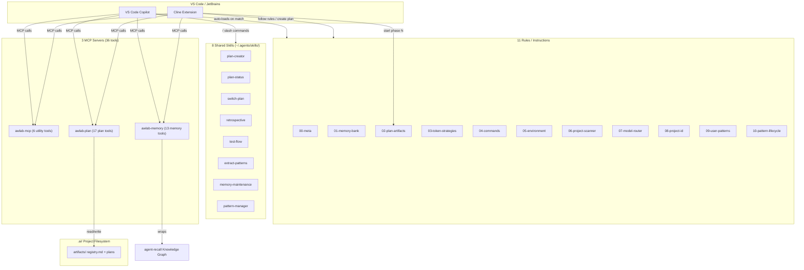
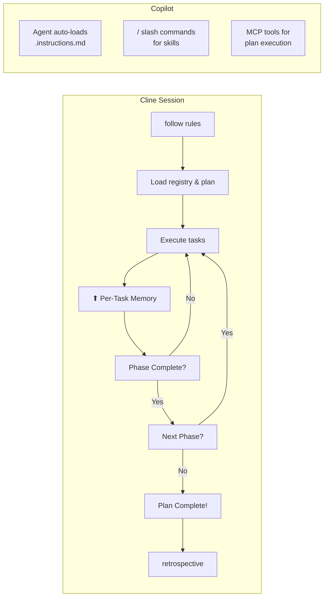
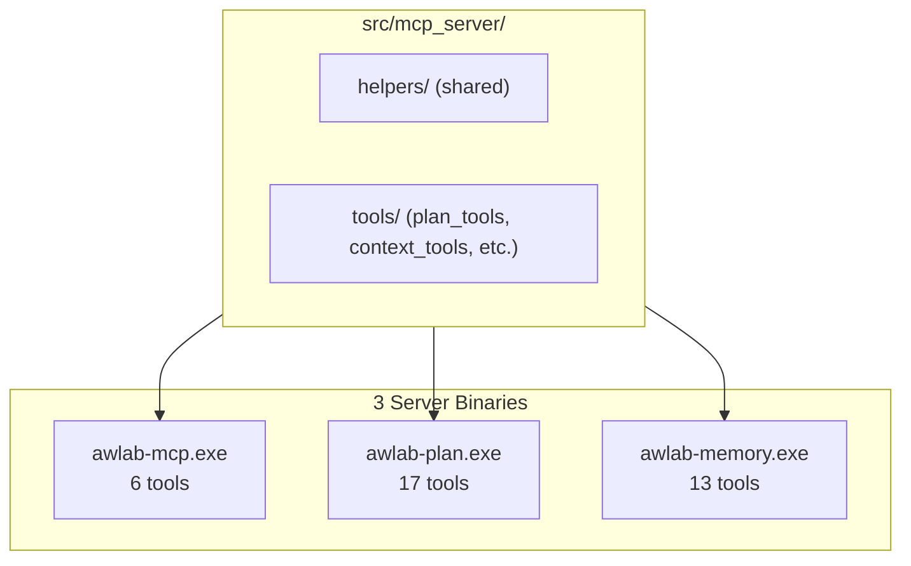

# Cline AI-Assisted Development System

**Rules · Workflows · Skills · MCP Server — by AWLab-ID**

Transforms [Cline](https://github.com/cline/cline) and [VS Code Copilot](https://code.visualstudio.com/docs/copilot/overview) into project-aware AI development assistants with structured plan management, persistent cross-session memory via knowledge graph, and a deterministic MCP server (30+ tools). Supports both environments with automatically adapted rules and shared skills.

---

## Architecture



## Session Flow



---

## Quick Start

```bash
# Clone & install
git clone https://github.com/awsomplak/cline-ai-assisted-dev.git
cd cline-ai-assisted-dev
chmod +x install.sh && ./install.sh          # macOS/Linux
.\install.ps1                                 # Windows

# Install MCP server
pip install -e .

# Build standalone executable (default: current OS)
python scripts/run.py build
python scripts/run.py build --target-os=all  # All OSes (specs for non-host)
python scripts/run.py build --target-os=linux  # Specific OS
```

The built executables are at `dist/bin/awlab-mcp.exe`, `dist/bin/awlab-plan.exe`, and `dist/bin/awlab-memory.exe` — fully standalone, no Python or source files needed.

**Cline**: `follow rules` → `create plan` → `start phase 1` → `/plan-status`

**Copilot**: Instructions auto-load; invoke skills via `/create plan`, `/plan-status`, `/retrospective`, `/test-flow`

---

## Components

### MCP Servers (36 tools across 3 servers)

Split across 3 servers to work around Copilot's per-server tool visibility limit (~15 tools/server):

#### 🔧 awlab-mcp (6 tools — Utility & Context)

| Server | Tool | Purpose |
|--------|------|---------|
| `awlab-mcp` | `util_get_version` | Return MCP server build version |
| `awlab-mcp` | `util_get_project_meta` | Return local project build metadata |
| `awlab-mcp` | `ctx_get_snapshot` | Active plan + patterns + project ID snapshot |
| `awlab-mcp` | `ctx_read_memory_bank` | Read allowed files from `.ai/memory-bank/` |
| `awlab-mcp` | `ctx_scan_project` | Detect framework, entry points, relationships |
| `awlab-mcp` | `ctx_suggest_files` | Suggest files relevant to a task description |

#### 📋 awlab-plan (17 tools — Registry, Tasks & Workflows)

| Server | Tool | Purpose |
|--------|------|---------|
| `awlab-plan` | `reg_list_registry` | Return Active/Paused/Completed plans as JSON |
| `awlab-plan` | `reg_switch_active_plan` | Change the active plan in the registry |
| `awlab-plan` | `reg_validate_phase_gate` | Check if predecessor phase is complete |
| `awlab-plan` | `reg_get_next_eligible_task` | Find next non-blocked, non-terminal task |
| `awlab-plan` | `reg_mark_phase_complete` | Mark all tasks in a phase as completed |
| `awlab-plan` | `reg_resolve_deferred_tasks` | Re-evaluate deferred ⏳ tasks |
| `awlab-plan` | `reg_check_plan_completable` | Verify all tasks are terminal |
| `awlab-plan` | `reg_generate_retrospective` | Extract patterns from completed plan |
| `awlab-plan` | `task_update_status` | Update a task's status marker |
| `awlab-plan` | `task_batch_update` | Atomically update multiple tasks |
| `awlab-plan` | `task_validate_transition` | Check if a status transition is legal |
| `awlab-plan` | `task_read_plan_tasks` | Parse tasks.md into structured/raw/minimal |
| `awlab-plan` | `task_write_plan_tasks` | Write markdown to tasks.md |
| `awlab-plan` | `task_format_markdown` | Format task list as markdown |
| `awlab-plan` | `wf_execute` | Execute a named workflow |
| `awlab-plan` | `wf_list` | List available workflow files |
| `awlab-plan` | `util_generate_mermaid` | Generate Mermaid flowcharts |

#### 🧠 awlab-memory (13 tools — Memory & Context Store)

| Server | Tool | Purpose |
|--------|------|---------|
| `awlab-memory` | `mem_search` | Search memory with hybrid BM25+dense ranking |
| `awlab-memory` | `mem_store` | Store an observation (creates entity if needed) |
| `awlab-memory` | `mem_list_patterns` | List all stored patterns |
| `awlab-memory` | `mem_create_entities` | Create new entities in memory |
| `awlab-memory` | `mem_tag_entity` | Tag an entity with context labels |
| `awlab-memory` | `mem_relate` | Declare a semantic association |
| `awlab-memory` | `mem_fetch_node_details` | Query attributes of graph nodes |
| `awlab-memory` | `mem_read_graph` | Read the knowledge graph |
| `awlab-memory` | `mem_archive_entities` | Move entities to archive state |
| `awlab-memory` | `mem_delete_observations` | Remove observations from entities |
| `awlab-memory` | `mem_delete_relations` | Remove relations between entities |
| `awlab-memory` | `ctx_store` | Store context fragments with TTL |
| `awlab-memory` | `ctx_get_fragment` | Retrieve context without file reads |

### MCP Servers (3 binaries)

3 standalone MCP servers, each built via PyInstaller, serving different tool domains:

| Binary | Server Name | Tools | Entry Point |
|--------|-------------|-------|-------------|
| `awlab-mcp.exe` | `awlab-mcp` | 6 utility & context tools | `src/mcp_server/__main__.py` |
| `awlab-plan.exe` | `awlab-plan` | 17 plan/registry/task/workflow tools | `src/mcp_server/__main_plan__.py` |
| `awlab-memory.exe` | `awlab-memory` | 13 memory & context store tools | `src/mcp_server/__main_memory__.py` |



**Workspace resolution**: Parameter-driven — agent passes `workspace_path` explicitly. DB path resolves via 4-level fallback (`DB_PATH` env → `.ai/project-id` file → `~/.awlab-id/agent-memory/memory/`).

---

## Portability

| Environment | Rules | Skills | Invocation |
|-------------|-------|--------|------------|
| **Cline** | `~/Documents/Cline/Rules/*.md` | `~/.agents/skills/` | `follow rules`, `create plan`, `/plan-status` |
| **Copilot** | `~/.copilot/instructions/*.instructions.md` | `~/.agents/skills/` | Auto-loads on keyword match, `/` slash commands |
| **Cursor** | `Cline/portability/cursor-adapter.md` | — | Adapter guide |
| **Windsurf** | `Cline/portability/windsurf-adapter.md` | — | Adapter guide |

Skills are shared at `~/.agents/skills/`. Environment-aware skills (`plan-creator`, `extract-patterns`) auto-detect Cline vs Copilot via `$ENV` to adjust file extensions, paths, and behaviors.

---

## Project Structure

```
cline-ai-assisted-dev/
├── Cline/Rules/           # 11 rule files (00-meta → 10-pattern-lifecycle)
├── Cline/Skills/          # plan-creator + 6 templates
├── Cline/Workflows/       # plan-status, switch-plan, retrospective, test-flow
├── Cline/portability/     # Cursor, Windsurf adapters
├── src/mcp_server/        # Python MCP server (36 tools across 3 binaries)
│   ├── server.py          # FastMCP entry point (awlab-mcp)
│   ├── server_plan.py     # Entry point (awlab-plan)
│   ├── server_memory.py   # Entry point (awlab-memory)
│   ├── config.py          # Settings + workspace resolver
│   ├── helpers/           # agent_recall wrapper, file_utils, etc.
│   ├── tools/             # plan_tools, memory_tools, context_tools/
│   └── modules/           # lifecycle, registration, registration_plan, registration_memory
├── scripts/
│   ├── run.py             # Build & dev script
│   ├── test_all_mcp_tools.py  # MCP protocol test
│   ├── check_split.py     # Verifies no tool overlap between servers
│   ├── approve_all_tools.py   # Pre-approve tools in VS Code state DB
│   └── stop-mcp-servers.ps1  # Stop all awlab-* processes
├── tests/                 # Pytest suite
├── assets/                # Profiles, rules, skills
├── install.sh / .ps1      # Installers
├── docs/mcp-server-split-report.md  # Full split analysis
└── pyproject.toml         # Package definition
```

### User-Level Deployment

```
~/.copilot/instructions/   # 11 .instructions.md files
~/.agents/skills/          # 8 shared skills (plan-creator, plan-status, switch-plan,
                           #   retrospective, test-flow, extract-patterns,
                           #   memory-maintenance, pattern-manager)
```

### Per-Project `.ai/` Structure

```
{project-root}/.ai/
├── project-id             # Auto-generated stable identifier
├── artifacts/registry.md  # Plan registry (single source of truth)
└── artifacts/{uuid}/      # plan.md, tasks.md, notes.md
```

---

## Requirements

- **Cline** (VS Code/JetBrains) or **VS Code Copilot**
- **Python 3.10+** (for MCP server)
- **AI model** with tool-calling support
- Model pairing: 🟢 Simple → Local 1.5B–3B · 🟡 Medium → Local 14B–32B · 🔴 Complex → Frontier (Claude, GPT)

---

## License

MIT — Use, modify, and share freely.