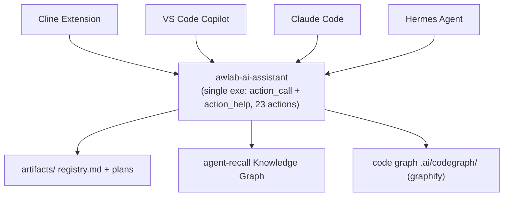
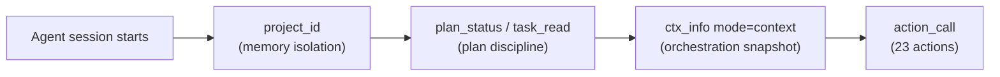

<p align="center">
  <strong>AWLab-ID — AI-Assisted Development System</strong><br/>
  Rules · Workflows · Skills · One Deterministic MCP Server
</p>

<p align="center">
  <strong>🌐 Language:</strong> <a href="README.md">English</a> · <a href="README_ID.md">Bahasa Indonesia</a>
</p>

<p align="center">
  
  
  
  
  
</p>

<p align="center">
  
  
</p>

<p align="center">
  <a href="#-about">About</a> &bull;
  <a href="#️-architecture">Architecture</a> &bull;
  <a href="#️-how-it-works">How it works</a> &bull;
  <a href="#-features">Features</a> &bull;
  <a href="#-tested-on">Tested on</a> &bull;
  <a href="#-documentation">Documentation</a> &bull;
  <a href="#-your-project-stays-clean">Clean project</a> &bull;
  <a href="#-requirements">Requirements</a> &bull;
  <a href="#️-license">License</a>
</p>

<p align="center">
  
</p>

---

## 💡 About

AWLab-ID **AI-Assisted Development System** turns a plain project into a project-aware AI development environment. It ships:

- **14 composable rules + 5 skills** (sources under `assets/`) that are compiled into **per-agent profiles** — Cline, VS Code Copilot, Claude Code, Hermes Agent, and OpenCode each get their native format automatically.
- **A single deterministic MCP server** — `awlab-ai-assistant` (one standalone executable) exposing **2 tools** — `action_call` + `action_help` — that route **23 actions** across plan, task, memory, graph, context, util, and workflow. One `REGISTRY` dict is the single source of truth for everything the agent sees, so nothing drifts.
- **Structured plan management** with server-owned, validated state transitions, **cross-session memory** on a knowledge graph, and a **code knowledge graph** with incremental rebuilds (~40× faster).

The core promise: your agent **remembers the project across sessions**, follows a **consistent plan discipline**, and sees a **minimal, deterministic MCP surface** — no tool sprawl, no hallucinated state, no silent memory loss (offline mutations are queued and replayed).

---

## 🏗️ Architecture

A visual overview of the components and how agents connect to the server:



---

## ⚙️ How it works

Every session follows a predictable flow:



1. **Agent session starts** — the agent begins working on your project.
2. **`project_id`** — *(memory isolation)* confirms or creates the project identity so all memory stays scoped to this project, never leaking into the global store.
3. **`plan_status` / `task_read`** — *(plan discipline)* loads the active plan and the next eligible task, so the agent works from a consistent, server-owned state.
4. **`ctx_info mode="context"`** — *(orchestration snapshot)* assembles plan + next task + relevant code + memory in one server-owned call and atomically writes `.ai/memory-bank/context.md`.
5. **`action_call`** — *(23 actions)* drives the rest of the work through the action surface (plan, task, memory, code graph, context). If a store or the server is ever unreachable, mutations are queued to `.ai/memory-bank/pending.jsonl` and replayed via `mem_replay` — nothing is silently lost.

---

## ✨ Features

| Feature | Description |
|---------|-------------|
| **One deterministic MCP surface** | A single `REGISTRY` drives `action_call` + `action_help` and the generated SKILL.md — one source of truth, no drift, and no partial execution (preconditions + pipeline). |
| **Plan artifacts** | Per-project registry (`plan.md` / `tasks.md` / `notes.md`) with server-owned, validated state transitions (`plan_status`, `plan_update`, `task_read`, `task_update`, `plan_doc`). |
| **Cross-session memory** | Persistent knowledge-graph memory backed by agent-recall, with hybrid BM25 + dense search and entity-type filtering (`mem_write`, `mem_search`, `mem_read`, `mem_remove`, …). |
| **Pattern-baking core** | An observation store (`.ai/memory-bank/observations.jsonl`) records user-pattern evidence (`mem_observe`) that the baking pipeline keys → counts → measures consistency → computes confidence. |
| **Code knowledge graph** | AST-only structural graph with incremental rebuild (only changed files re-extracted), powering cheap auto-refresh and code-aware queries (`graph_build` … `graph_explain`). |
| **Project families** | Correlated projects at different paths share a merged code graph and a dedicated `family_<slug>` memory store, with file-authoritative project-id reconciliation. |
| **Offline cache** | Intended mutations are queued to `.ai/memory-bank/pending.jsonl` when the server or a store is unavailable, then replayed via `mem_replay` — state is never silently lost. |
| **Agentic orchestration** | A single `ctx_info mode="context"` call assembles plan, next task, code, and memory, and atomically writes `.ai/memory-bank/context.md`; graph reads correlate related memory. |

---

## ✅ Tested on

### Supported AI agents

The compiled rules + skills and the MCP server are verified on all four agents:

| Agent | Status | Notes |
|-------|--------|-------|
| [Cline](https://github.com/cline/cline) | ✅ tested | Individual `.md` rule files in `~/Documents/Cline/Rules/` |
| [VS Code Copilot](https://code.visualstudio.com/docs/copilot/overview) | ✅ tested | `.instructions.md` files with YAML frontmatter |
| [Claude Code](https://docs.anthropic.com/en/docs/claude-code) | ✅ tested | Single `CLAUDE.md` monolith with heading anchors |
| [Hermes Agent](https://github.com/nousresearch/hermes-agent) | ✅ tested | Rules packaged as `awlab-rules/SKILL.md` |
| [OpenCode](https://opencode.ai) | 🆕 supported | Global `AGENTS.md` + skills in `~/.config/opencode/` |

### Supported operating systems

The server builds and runs on all major platforms (build + usage tested):

| OS | Build & Test |
|----|--------------|
| **Windows** | ✅ tested |
| **Linux** | ✅ tested |
| **macOS** | ✅ tested |

---

## 📚 Documentation

This README is the single documentation entry point. Use the tables below to find the right page.

### Where do you want to go?

| I want to… | Go to |
|-----------|-------|
| Understand what this project is and its features | *(you're already here — keep reading)* |
| Install the MCP server, build it, and wire it into my AI agent | [Install & Implement](docs/en/INSTALL.md) |
| See every MCP action (`action_call` / `action_help`) and what it does | [Available MCP Tools](docs/en/AVAILABLE_TOOLS.md) |
| Register the optional hook automation layer (zero-LLM capture) | [Hook Registration](docs/en/HOOKS.md) |
| Read the Indonesian version | [README_ID.md](README_ID.md) |
| Read the version history | [CHANGELOG](CHANGELOG.md) |

### Document map

| Document | What it covers |
|----------|----------------|
| [`README.md`](README.md) | What AWLab-ID is, features, tested OS/agents, architecture (English) |
| [`README_ID.md`](README_ID.md) | What AWLab-ID is, features, tested OS/agents, architecture (Bahasa Indonesia) |
| [`docs/en/INSTALL.md`](docs/en/INSTALL.md) | Requirements, install from source, build the standalone executable, publish rules + skills, wire the MCP server per agent, environment variables, CLI reference |
| [`docs/en/AVAILABLE_TOOLS.md`](docs/en/AVAILABLE_TOOLS.md) | The 2 exposed MCP tools and the **23 actions** they route (plan, task, memory, graph, context, util, workflow), plus graph freshness, offline cache, and project families |
| [`docs/en/HOOKS.md`](docs/en/HOOKS.md) | Optional zero-LLM hook automation — per-agent registration (Claude Code, Hermes, Cline, Copilot), event behaviour, pros/cons vs MCP-only, verification & troubleshooting |
| [`CHANGELOG.md`](CHANGELOG.md) | Version-by-version release notes |

### Fastest path (new user)

1. **Install** the package and (optionally) build the standalone executable — see [`docs/en/INSTALL.md`](docs/en/INSTALL.md#install-the-mcp-server).
2. **Publish** the compiled rules + skills to your agent — see [`docs/en/INSTALL.md`](docs/en/INSTALL.md#publish-rules--skills-to-your-agent).
3. **Wire** the MCP server into your agent — see [`docs/en/INSTALL.md`](docs/en/INSTALL.md#wire-the-mcp-server).
4. **Explore** the tool surface — see [`docs/en/AVAILABLE_TOOLS.md`](docs/en/AVAILABLE_TOOLS.md).

---

## 🧹 Your project stays clean

AWLab-ID keeps **all** of its state inside a single `.ai/` directory at your project root — the agent's plans, memory, and code graph are never scattered as loose files across your repository:

```
{project-root}/.ai/
├── project-id             # Stable project identifier (memory isolation)
├── artifacts/             # Plan artifacts
│   ├── registry.md        # Plan registry
│   └── {uuid}/            # plan.md, tasks.md, notes.md
├── memory-bank/           # environment.md (static) + context.md (dynamic) + observations.jsonl + pending.jsonl
├── codegraph/             # Code knowledge graph (graph.json, graph.html, cache)
└── temp/                  # Scratch/temp files — following file-hygiene rule
```

No junk files, no scattered state — everything the AI assistant creates lives inside `.ai/`, so your source tree stays exactly as you'd expect.

---

## 📋 Requirements

- **Python 3.10+** (for the MCP server)
- **agent-recall** (knowledge-graph memory backend)
- **graphifyy** (code knowledge-graph indexing)
- One of: **Cline**, **VS Code Copilot**, **Claude Code**, **Hermes Agent**, or **OpenCode**

---

## ⚖️ License

MIT — Use, modify, and share freely. See [LICENSE](LICENSE).