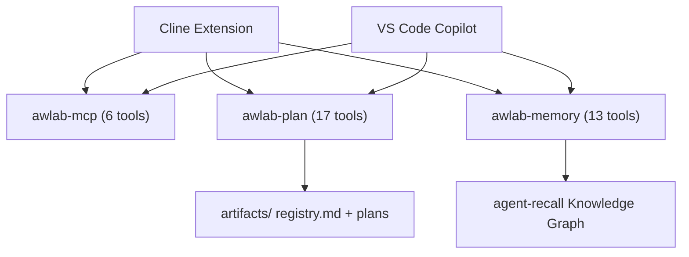

# AWLab-ID — AI-Assisted Development System

**Rules · Workflows · Skills · MCP Server**

Transforms:
- [Cline](https://github.com/cline/cline),
- [VS Code Copilot](https://code.visualstudio.com/docs/copilot/overview) (Experimental),
- [Claude Code](https://docs.anthropic.com/en/docs/claude-code) (Experimental), and
- [Hermes Agent](https://github.com/nousresearch/hermes-agent) (Experimental)

into project-aware AI development assistants with structured plan management, persistent cross-session memory via knowledge graph, and 3 deterministic MCP servers (36 tools).

---

## Architecture



---

## Quick Start

```bash
pip install -e .
python scripts/run.py compile-rules
python scripts/run.py publish --target=all
```

See [Installation & CLI Reference](docs/INSTALL.md) for full instructions.

---

## Documentation

| Document | Description |
|----------|-------------|
| [Installation & CLI Reference](docs/INSTALL.md) | Requirements, install, build, publish, CLI commands |
| [Available MCP Tools](docs/AVAILABLE_TOOLS.md) | All 36 tools across 3 servers with descriptions |
| [Project Structure](#project-structure) | Repository layout |
| [User-Level Deployment](#user-level-deployment) | Per-agent file paths |
| [CHANGELOG](CHANGELOG.md) | Version history |

---

## Per-Agent Compilation Pipeline

Rules (`assets/rules/`) and skills (`assets/skills/`) are compiled into per-agent profiles via `python scripts/run.py compile-rules`:

| Agent | Rules | Skills |
|-------|-------|--------|
| **Cline** | Individual `.md` files → `~/Documents/Cline/Rules/` | `SKILL.md` → `~/.agents/skills/` |
| **Copilot** | `.instructions.md` with YAML frontmatter → `~/.copilot/instructions/` | `SKILL.md` → `~/.agents/skills/` (shared) |
| **Claude Code** | `CLAUDE.md` monolith (heading anchors) → `~/.claude/` | `SKILL.md` → `~/.claude/skills/` |
| **Hermes Agent** | Packaged as `awlab-rules/SKILL.md` | `SKILL.md` → `~/.hermes/skills/` |

---

## Project Structure

```
project-root/
├── assets/
│   ├── rules/                   # 13 rule files (source)
│   ├── skills/                  # 4 skill sources
│   └── profiles/                # Per-agent compiled output (generated by compile-rules)
├── src/mcp_server/              # Python MCP server (36 tools, 3 binaries)
├── scripts/
│   ├── run.py                   # Build & dev CLI
│   └── stop-mcp-servers.ps1     # Helper executeable to force stop all running `awlab-*` mcp server (Windows powershell only)
├── tests/                       # Pytest suite
├── docs/                        # Documentation
├── CHANGELOG.md
└── pyproject.toml
```

### User-Level Deployment

```
# Cline
~/Documents/Cline/Rules/     # 13 .md rule files
~/.agents/skills/            # 4 skills + awlab-rules (shared with Copilot)
.clinerules                  # Compiled rules to single .clinerules for per-project without global rules

# Copilot
~/.copilot/instructions/     # 13 .instructions.md files
~/.agents/skills/            # 4 skills + awlab-rules (shared with Cline)

# Claude Code
~/.claude/CLAUDE.md          # Compiled rule monolith
~/.claude/skills/            # 4 skills + awlab-rules

# Hermes
~/.hermes/skills/            # 4 skills + awlab-rules
```

### Per-Project `.ai/` Structure

```
{project-root}/.ai/
├── project-id             # Stable project identifier
├── artifacts/registry.md  # Plan registry
├── artifacts/{uuid}/      # plan.md, tasks.md, notes.md
└── memory-bank/           # Knowledge graph via agent-recall
```

---

## Requirements

- **Cline** (VS Code/JetBrains) or **VS Code Copilot**
- **Python 3.10+** (for MCP server)
- **agent-recall** (knowledge graph backend)
## License

MIT — Use, modify, and share freely.