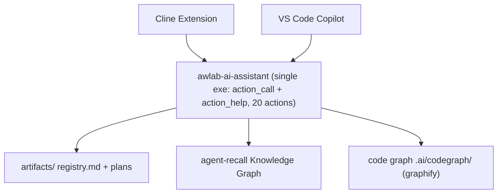

# AWLab-ID — AI-Assisted Development System

**Rules · Workflows · Skills · MCP Server**

Project-aware AI development assistants with structured plan management, persistent cross-session memory via a knowledge graph, a code knowledge graph, and **one deterministic MCP server** (`awlab-ai-assistant`, single executable) exposing **2 tools** that route **20 actions**.

**Agent support**:

| Agent | Status |
|-------|--------|
| [Cline](https://github.com/cline/cline) | ✅ tested |
| [VS Code Copilot](https://code.visualstudio.com/docs/copilot/overview) | ✅ tested |
| [Claude Code](https://docs.anthropic.com/en/docs/claude-code) | ✅ tested |
| [Hermes Agent](https://github.com/nousresearch/hermes-agent) | ✅ tested |

**Cross-platform** — the server builds and runs on all major platforms (build + usage tested):

| OS | Build & Test |
|----|--------------|
| **Windows** | ✅ tested |
| **Linux** | ✅ tested |
| **macOS** | ✅ tested |

---

## Features

| Feature | Description |
|---------|-------------|
| **Plan artifacts** | Per-project registry (`plan.md` / `tasks.md` / `notes.md`) with server-owned, validated state transitions (`plan_status`, `plan_update`, `task_read`, `task_update`). |
| **Cross-session memory** | Persistent knowledge-graph memory backed by agent-recall, with hybrid BM25 + dense search and entity-type filtering (`mem_write`, `mem_search`, `mem_read`, `mem_remove`). |
| **Project families** | Correlated projects at different paths share a merged code graph and a dedicated `family_<slug>` memory store, with file-authoritative project-id reconciliation and fresh-member seeding. |
| **Offline cache** | Intended mutations are queued to `.ai/memory-bank/pending.jsonl` when the server or a store is unavailable, then replayed via `mem_replay` — state is never silently lost. |
| **Code knowledge graph** | AST-only structural graph with incremental rebuild (only changed files re-extracted, ~40× faster), powering cheap auto-refresh and code-aware queries (`graph_build` … `graph_explain`). |
| **Agentic orchestration** | A single `ctx_info mode="context"` call assembles plan, next task, code, and memory, and atomically writes `.ai/memory-bank/context.md`; graph reads correlate related memory. |
| **One deterministic MCP surface** | A single `REGISTRY` drives `action_call` + `action_help` and the generated SKILL.md — one source of truth, no drift, and no partial execution (preconditions + pipeline). |

---

## Architecture



---

## Quick Start

```bash
pip install -e .
python scripts/run.py compile-rules
python scripts/run.py publish --target=all
```

See [Installation & CLI Reference](docs/INSTALL.md) for full instructions.

---

## Documentation

| Document | Description |
|----------|-------------|
| [Installation & CLI Reference](docs/INSTALL.md) | Requirements, install, build, publish, CLI commands |
| [Available MCP Tools](docs/AVAILABLE_TOOLS.md) | `action_call` + `action_help` and the 20 actions |
| [REGISTRY Schema](docs/REGISTRY_SCHEMA.md) | Design doc for the single action surface (no drift) |
| [Project Structure](#project-structure) | Repository layout |
| [User-Level Deployment](#user-level-deployment) | Per-agent file paths |
| [CHANGELOG](CHANGELOG.md) | Version history |

---

## Per-Agent Compilation Pipeline

Rules (`assets/rules/`) and skills (`assets/skills/`) are compiled into per-agent profiles via `python scripts/run.py compile-rules`:

| Agent | Rules | Skills |
|-------|-------|--------|
| **Cline** | Individual `.md` files → `~/Documents/Cline/Rules/` | `SKILL.md` → `~/.agents/skills/` |
| **Copilot** | `.instructions.md` with YAML frontmatter → `~/.copilot/instructions/` | `SKILL.md` → `~/.agents/skills/` (shared) |
| **Claude Code** | `CLAUDE.md` monolith (heading anchors) → `~/.claude/` | `SKILL.md` → `~/.claude/skills/` |
| **Hermes Agent** | Packaged as `awlab-rules/SKILL.md` | `SKILL.md` → `~/.hermes/skills/` |

---

## Project Structure

```
project-root/
├── assets/
│   ├── rules/                   # 14 rule files (source)
│   └── skills/                  # 5 skill sources
├── dist/
│   └── profiles/                # Per-agent compiled output (generated by compile-rules)
├── src/mcp_server/              # Python MCP server (single exe: action_call + action_help, 20 actions)
├── scripts/
│   ├── run.py                   # Build & dev CLI
│   └── stop-mcp-servers.ps1     # Helper executeable to force stop all running `awlab-*` mcp server (Windows powershell only)
├── tests/                       # Pytest suite
├── docs/                        # Documentation
├── CHANGELOG.md
└── pyproject.toml
```

### User-Level Deployment

```
# Cline
~/Documents/Cline/Rules/     # 14 .md rule files
~/.agents/skills/            # 5 skills + awlab-rules (shared with Copilot)
.clinerules                  # Compiled rules to single .clinerules for per-project without global rules

# Copilot
~/.copilot/instructions/     # 14 .instructions.md files
~/.agents/skills/            # 5 skills + awlab-rules (shared with Cline)

# Claude Code
~/.claude/CLAUDE.md          # Compiled rule monolith
~/.claude/skills/            # 5 skills + awlab-rules

# Hermes
~/.hermes/skills/            # 5 skills + awlab-rules
```

### Per-Project `.ai/` Structure

```
{project-root}/.ai/
├── project-id             # Stable project identifier
├── artifacts/registry.md  # Plan registry
├── artifacts/{uuid}/      # plan.md, tasks.md, notes.md
├── memory-bank/           # environment.md (static) + context.md (dynamic orchestration state)
└── codegraph/             # Code knowledge graph (graph.json, graph.html, cache)
```

---

## Requirements

- **Cline** (VS Code/JetBrains) or **VS Code Copilot**
- **Python 3.10+** (for MCP server)
- **agent-recall** (knowledge graph backend)
## License

MIT — Use, modify, and share freely.