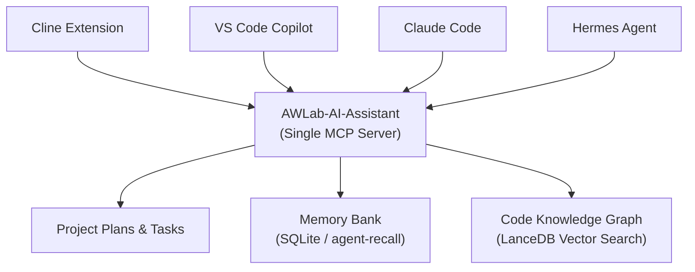
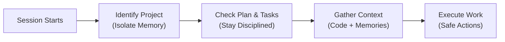

<p align="center">
  <strong>AWLab-AI-Assistant — AI-Assisted Development System</strong><br/>
  <em>Powered by AWLab-ID</em><br/>
  Rules · Workflows · Skills · One Deterministic MCP Server
</p>

<p align="center">
  <strong>🌐 Language:</strong> <a href="README.md">English</a> · <a href="README_ID.md">Bahasa Indonesia</a>
</p>

<p align="center">
  
  
  
  
  
</p>

<p align="center">
  
  
</p>

<p align="center">
  <a href="#-about">About</a> &bull;
  <a href="#️-architecture">Architecture</a> &bull;
  <a href="#️-how-it-works">How it works</a> &bull;
  <a href="#-features">Features</a> &bull;
  <a href="#-tested-on">Tested on</a> &bull;
  <a href="#-documentation">Documentation</a> &bull;
  <a href="#-your-project-stays-clean">Clean project</a> &bull;
  <a href="#-requirements">Requirements</a> &bull;
  <a href="#️-license">License</a>
</p>

<p align="center">
  
</p>

---

## 💡 About

AWLab-AI-Assistant supercharges your AI assistant by giving it **long-term memory**, **strategic planning abilities**, and an **instant understanding of your entire codebase**.

Most AI coding assistants suffer from a short attention span: they forget what you told them yesterday, get confused by large projects, and stumble through complex tasks without a plan.

AWLab-AI-Assistant solves this by transforming your plain project into a **Project-Aware AI Development Environment**. It provides:

- **A Single, Reliable Connection (MCP)** — Instead of confusing your AI with too many tools, we provide one clean interface. This prevents the AI from hallucinating commands or taking destructive actions.
- **Strategic Planning** — The AI creates, follows, and updates a structured plan for every task, ensuring it never loses its place.
- **Dual-Brain Architecture** —
  - **Memory Bank (SQLite):** Learns your preferences, rules, and past decisions across sessions.
  - **Code Knowledge Graph (Graphify + LanceDB):** Instantly vectorizes and understands your code's structure so the AI doesn't have to read every file manually.

---

## 🏗️ Architecture

A simple overview of how your favorite AI agents connect to our intelligent server:



---

## ⚙️ How it works

Every time you start a new session, the AI follows a highly disciplined, predictable flow:



1. **Session Starts** — You ask your AI agent to build a feature or fix a bug.
2. **Identify Project** — The AI checks which project it's in to ensure it only uses memories relevant to this specific codebase.
3. **Check Plan & Tasks** — The AI reads the active plan to pick up exactly where it left off.
4. **Gather Context** — In a single step, the server bundles the plan, the next task, relevant code snippets, and your past instructions together so the AI has perfect context.
5. **Execute Work** — The AI uses our safe, validated tools to write code, update the plan, and save new memories. If the connection drops, work is safely queued and replayed later!

---

## ✨ Features

| Feature                        | Why you'll love it                                                                                                                                               |
| ------------------------------ | ---------------------------------------------------------------------------------------------------------------------------------------------------------------- |
| **Laser Focus (One Tool)**     | The AI only sees one main tool, eliminating confusion, tool sprawl, and unpredictable behavior.                                                                  |
| **Built-in Task Manager**      | The AI maintains its own `plan.md` and `tasks.md` documents, meticulously checking off tasks as it works so it never gets lost.                                  |
| **Human-Like Memory**          | Using our SQLite `agent-recall` backend, the AI remembers your coding style, past bugs, and architectural decisions across reboots.                              |
| **Pattern Learning**           | The system quietly observes how you correct the AI. If you tell it "always use X instead of Y", it records that rule and applies it automatically in the future. |
| **Instant Code Understanding** | Using a local **LanceDB** vector database, the server instantly maps your codebase (functions, classes, files) so the AI can find relevant code in milliseconds. |
| **Multi-Project Intelligence** | Working on a frontend and backend in separate folders? They can share a united code graph and memory bank.                                                       |
| **Offline Safety Net**         | If a database is locked or unavailable, the AI's thoughts and memories are cached locally and synced the moment it's safe.                                       |
| **One-Shot Context**           | The AI pulls all necessary context (plans, tasks, code, memories) in a single, perfectly orchestrated snapshot.                                                  |

---

## 🛡️ Performance & Token Protections

The MCP server architecture is heavily optimized to protect your LLM's context window. There are no accidental token burn traps:

1. **Structural Plan Parsing (`ctx_info`)** — Instead of dumping the entire `plan.md` into the context on every initialization, `ctx_info` strips out massive paragraphs and only extracts bullet points for approaches, expected outcomes, and open questions.
2. **Graph Returns (`graph_query`, `graph_explain`)** — Nodes returned by the graph do **not** include raw source code snippets (only IDs, labels, and file locations). The agent must explicitly request to read the file, preventing massive AST dumps in the prompt.
3. **Hard Limits** — `graph_query` defaults to `limit=10`, `graph_explain` limits neighbors to 30, and `mem_search` caps at 5-10 results.
4. **Memory Inventory (`mem_list_entities`)** — Instead of returning full memory entities with their observation histories, the inventory truncates the output to just `{name, entityType, observation_count}`.

> [!TIP]
> **Designed for Long-Running Projects:**
> AWLab-AI-Assistant handles all token protections automatically under the hood. The system dynamically enforces protocols that instruct AI agents to avoid massive raw file dumps and instead rely on optimized endpoints like `ctx_info`. This ensures your agent stays focused and productive for months without exhausting its context window or driving up your API costs!

---

## ✅ Tested on

### Supported AI agents

The compiled rules + skills and the MCP server are verified on all four agents:

| Agent                                                                                                                    | Status       | Notes                                                             |
| ------------------------------------------------------------------------------------------------------------------------ | ------------ | ----------------------------------------------------------------- |
| [Cline](https://github.com/cline/cline)                                                                                  | ✅ tested    | Individual `.md` rule files in `~/Documents/Cline/Rules/`         |
| [VS Code Copilot](https://code.visualstudio.com/docs/copilot/overview)                                                   | ✅ tested    | `.instructions.md` files with YAML frontmatter                    |
| [Claude Code](https://docs.anthropic.com/en/docs/claude-code)                                                            | ✅ tested    | Single `CLAUDE.md` monolith with heading anchors                  |
| [Hermes Agent](https://github.com/nousresearch/hermes-agent)                                                             | ✅ tested    | Rules packaged as `awlab-rules/SKILL.md`                          |
| [OpenCode](https://opencode.ai)                                                                                          | 🆕 supported | Global `AGENTS.md` + skills in `~/.config/opencode/`              |
| [Google Antigravity](https://antigravity.google) / [Antigravity IDE](https://antigravity.google/product/antigravity-ide) | ✅ tested    | Modular rules in `~/.gemini/config/rules/` + skills + MCP + hooks |

### Supported operating systems

The server builds and runs on all major platforms (build + usage tested):

| OS          | Build & Test |
| ----------- | ------------ |
| **Windows** | ✅ tested    |
| **Linux**   | ✅ tested    |
| **macOS**   | ✅ tested    |

---

## 📚 Documentation

This README is the single documentation entry point. Use the tables below to find the right page.

### Where do you want to go?

| I want to…                                                            | Go to                                             |
| --------------------------------------------------------------------- | ------------------------------------------------- |
| Understand what this project is and its features                      | _(you're already here — keep reading)_            |
| Install the MCP server, build it, and wire it into my AI agent        | [Install & Implement](docs/en/INSTALL.md)         |
| See every MCP action (`action_call` / `action_help`) and what it does | [Available MCP Tools](docs/en/AVAILABLE_TOOLS.md) |
| Configure multi-repository workspaces (unified graph & memory)        | [Project Families](docs/en/PROJECT_FAMILIES.md)   |
| Register the optional hook automation layer (zero-LLM capture)        | [Hook Registration](docs/en/HOOKS.md)             |
| Synchronize agent memory across devices via cloud (cr-sqlite)         | [Cloud Memory Support](docs/en/CRDT_SYNC.md)      |
| Read the Indonesian version                                           | [README_ID.md](README_ID.md)                      |
| Read the version history                                              | [CHANGELOG](CHANGELOG.md)                         |

### Document map

| Document                                                     | What it covers                                                                                                                                                            |
| ------------------------------------------------------------ | ------------------------------------------------------------------------------------------------------------------------------------------------------------------------- |
| [`README.md`](README.md)                                     | What AWLab-AI-Assistant is, features, tested OS/agents, architecture (English)                                                                                            |
| [`README_ID.md`](README_ID.md)                               | What AWLab-AI-Assistant is, features, tested OS/agents, architecture (Bahasa Indonesia)                                                                                   |
| [`docs/en/CRDT_SYNC.md`](docs/en/CRDT_SYNC.md)               | Experimental guide on enabling CRDT memory sync across the cloud                                                                                                          |
| [`docs/en/INSTALL.md`](docs/en/INSTALL.md)                   | Requirements, install from source, build the standalone executable, publish rules + skills, wire the MCP server per agent, environment variables, CLI reference           |
| [`docs/en/AVAILABLE_TOOLS.md`](docs/en/AVAILABLE_TOOLS.md)   | The 2 exposed MCP tools and the **23 actions** they route (plan, task, memory, graph, context, util, workflow), plus graph freshness, offline cache, and project families |
| [`docs/en/PROJECT_FAMILIES.md`](docs/en/PROJECT_FAMILIES.md) | Documentation on configuring project families for unified code graphs and shared episodic memory across multi-repository workspaces                                       |
| [`docs/en/HOOKS.md`](docs/en/HOOKS.md)                       | Optional zero-LLM hook automation — per-agent registration (Claude Code, Hermes, Cline, Copilot), event behaviour, pros/cons vs MCP-only, verification & troubleshooting  |
| [`CHANGELOG.md`](CHANGELOG.md)                               | Version-by-version release notes                                                                                                                                          |

### Fastest path (new user)

1. **Install** the package and (optionally) build the standalone executable — see [`docs/en/INSTALL.md`](docs/en/INSTALL.md#install-the-mcp-server).
2. **Publish** the compiled rules + skills to your agent — see [`docs/en/INSTALL.md`](docs/en/INSTALL.md#publish-rules--skills-to-your-agent).
3. **Wire** the MCP server into your agent — see [`docs/en/INSTALL.md`](docs/en/INSTALL.md#wire-the-mcp-server).
4. **Explore** the tool surface — see [`docs/en/AVAILABLE_TOOLS.md`](docs/en/AVAILABLE_TOOLS.md).

---

## 🧹 Your project stays clean

AWLab-AI-Assistant keeps **all** of its state inside a single `.ai/` directory at your project root — the agent's plans, memory, and code graph are never scattered as loose files across your repository:

```
{project-root}/.ai/
├── project-id             # Stable project identifier (memory isolation)
├── artifacts/             # Plan artifacts
│   ├── registry.md        # Plan registry
│   └── {uuid}/            # plan.md, tasks.md, notes.md
├── memory-bank/           # environment.md (static) + context.md (dynamic) + observations.jsonl + pending.jsonl
├── codegraph/             # Code knowledge graph (graph.json, graph.html, cache)
└── temp/                  # Scratch/temp files — following file-hygiene rule
```

> [!TIP]
> **No junk files, no scattered state** — everything the AI assistant creates lives inside `.ai/`, so your source tree stays exactly as you'd expect.

---

## 📋 Requirements

- **Python 3.10+** (for the MCP server)
- **agent-recall** (knowledge-graph memory backend)
- **graphify** (code knowledge-graph indexing)
- One of: **Cline**, **VS Code Copilot**, **Claude Code**, **Hermes Agent**, **OpenCode**, or **Google Antigravity / Antigravity IDE**

---

## ⚖️ License

MIT — Use, modify, and share freely. See [LICENSE](LICENSE).
