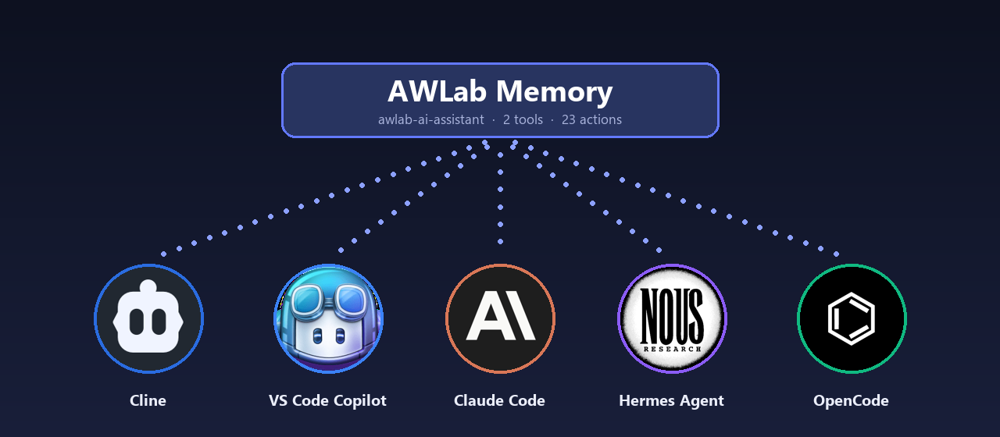
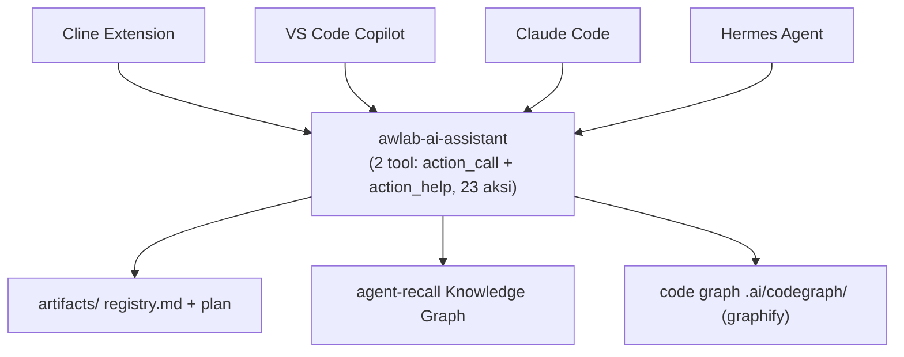
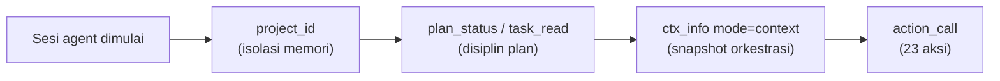

<p align="center">
  <strong>AWLab-ID — AI-Assisted Development System</strong><br/>
  Rules · Workflows · Skills · MCP
</p>

<p align="center">
  <strong>🌐 Bahasa:</strong> <a href="README.md">English</a> · <a href="README_ID.md">Bahasa Indonesia</a>
</p>

<p align="center">
  
  
  
  
  
</p>

<p align="center">
  
  
</p>

<p align="center">
  <a href="#-about">About</a> &bull;
  <a href="#️-arsitektur">Arsitektur</a> &bull;
  <a href="#️-cara-kerja">Cara kerja</a> &bull;
  <a href="#-fitur">Fitur</a> &bull;
  <a href="#-supported-agent">Supported Agent</a> &bull;
  <a href="#-dokumentasi">Dokumentasi</a> &bull;
  <a href="#-project-anda-tetap-bersih">Project yang bersih</a> &bull;
  <a href="#-requirements">Requirements</a> &bull;
  <a href="#️-lisensi">Lisensi</a>
</p>

<p align="center">
  
</p>

---

## 💡 About

AWLab-ID **AI-Assisted Development System** mengubah project biasa menjadi lingkungan pengembangan yang sadar-project untuk AI. Tool ini menyediakan:

- **14 rules + 5 skills** (sumbernya ada di `assets/`) yang dikompilasi menjadi **profil per-agent** — Cline, VS Code Copilot, Claude Code, Hermes Agent, dan OpenCode masing-masing profil otomatis disesuaikan formatnya agar dapat digunakan di tiap-tiap agent.
- **Satu server MCP** — `awlab-ai-assistant` (satu file executable) dengan **2 tool**: `action_call` dan `action_help`, yang mengarahkan **23 action** untuk plan, task, memory, graph, context, util, dan workflow. `REGISTRY` menjadi satu-satunya sumber acuan yang mengatur keseluruhan alur kerja (single source of truth), sehingga tidak ada yang melenceng (no drift).
- **Manajemen plan yang terstruktur** dengan perubahan status tervalidasi oleh server, **memori lintas sesi** dengan dukungan fitur knowledge graph, serta **code knowledge graph** dengan build ulang inkremental (~40× lebih cepat).

Intinya: agent Anda dapat **mengingat project lintas sesi**, disiplin dalam mengikuti **plan yang konsisten**, dan melihat **antarmuka tool MCP yang minimal serta deterministik** — tanpa tool yang menumpuk, tanpa state hasil halusinasi, dan tanpa kehilangan memori secara diam-diam (mutasi offline diantrekan lalu diterapkan kembali).

---

## 🏗️ Arsitektur

Ringkasan visual komponen dan bagaimana agent terhubung ke server:



---

## ⚙️ Cara kerja

Setiap sesi mengikuti alur yang konsisten dan terprediksi:



1. **Sesi agent dimulai** — agent mulai mengerjakan project Anda.
2. **`project_id`** — *(isolasi memori)* memastikan identitas project sudah ada atau membuatnya bila belum tersedia, sehingga semua memori tetap terisolasi di project ini.
3. **`plan_status` / `task_read`** — *(disiplin plan)* memuat plan yang aktif dan task berikutnya yang memenuhi syarat, jadi agent bekerja dari state yang konsisten.
4. **`ctx_info mode="context"`** — *(snapshot & orkestrasi)* merangkai plan + task berikutnya + kode yang relevan + memori dalam satu panggilan dari mcp server, lalu menulisnya di `.ai/memory-bank/context.md` secara atomik (dalam 1 rangkaian utuh tanpa ada yang terputus).
5. **`action_call`** — *(23 action)* tool yang berfungsi untuk menjalankan perintah kerja berdasarkan nama action-nya yang terdapat berbagai macam kegunaan seperti untuk perencanaan (plan), pembaruan tugas (task), memory, code graph, dan context. Jika koneksi mcp bermasalah atau tidak dapat diakses, semua proses akan disimpan ke `.ai/memory-bank/pending.jsonl` dan akan diimpor ulang lewat `mem_replay` — sehingga tidak ada informasi yang hilang secara diam-diam.

---

## ✨ Fitur

| Fitur | Deskripsi |
|-------|-----------|
| **MCP yang deterministik** | Satu `REGISTRY` untuk `action_call` + `action_help` beserta SKILL.md yang dihasilkan — cukup dari satu sumber acuan, tidak melenceng (no drift), tanpa eksekusi parsial (preconditions + pipeline). |
| **Plan artifacts** | Terdapat registry per-project (`plan.md` / `tasks.md` / `notes.md`) dengan transisi status tervalidasi dari mcp tool `action_call` (`plan_status`, `plan_update`, `task_read`, `task_update`, `plan_doc`). |
| **Cross-session memory** | Memori persisten berbasis agent-recall yang dipadukan dengan pencarian hibrida BM25 + dense serta filter jenis entitas (`mem_write`, `mem_search`, `mem_read`, `mem_remove`, …). |
| **Pattern-baking core** | Observation store (`.ai/memory-bank/observations.jsonl`) merekam bukti pola pengguna (`mem_observe`) yang diolah di balik layar: key → count → consistency → confidence. |
| **Code knowledge graph** | Graph struktural berbasis AST dari graphify dengan build ulang inkremental (hanya file yang berubah), mendukung auto-refresh dan query yang sadar-kode (`graph_build` … `graph_explain`). |
| **Project families** | Project terkait di lokasi terpisah berbagi code graph gabungan dan memori `family_<slug>` khusus, dengan rekonsiliasi project-id yang mengutamakan file. |
| **Offline cache** | Offline-aware yang memungkinkan menyimpan memori sementara ke `.ai/memory-bank/pending.jsonl` saat mcp server tidak tersedia, lalu diimpor ulang menggunakan `mem_replay` ketika mcp server kembali terhubung — state tetap tersimpan. |
| **Agentic orchestration** | Fitur `ctx_info mode="context"` merangkai plan, task berikutnya, kode, dan memori, lalu diekstrak ke dalam file `.ai/memory-bank/context.md` secara atomik dan menghubungkan memori yang terkait dengan graph. |

---

## ✅ Supported Agent

### Agent AI yang didukung

Rules + skill yang terkompilasi dan server MCP sudah terverifikasi (tested) pada kelima agent:

| Agent | Status | Catatan |
|------|--------|---------|
| [Cline](https://github.com/cline/cline) | ✅ tested | File rules `.md` terpisah di `~/Documents/Cline/Rules/` |
| [VS Code Copilot](https://code.visualstudio.com/docs/copilot/overview) | ✅ tested | File `.instructions.md` dengan frontmatter YAML |
| [Claude Code](https://docs.anthropic.com/en/docs/claude-code) | ✅ tested | Satu monolit `CLAUDE.md` dengan anchor heading |
| [Hermes Agent](https://github.com/nousresearch/hermes-agent) | ✅ tested | Rules dikemas sebagai `awlab-rules/SKILL.md` |
| [OpenCode](https://opencode.ai) | 🆕 support | `AGENTS.md` global + skill di `~/.config/opencode/` |

### Sistem operasi yang didukung

Mcp server bisa di-build dan dijalankan di semua platform (build & usage tested):

| OS | Build & Test |
|----|--------------|
| **Windows** | ✅ tested |
| **Linux** | ✅ tested |
| **macOS** | ✅ tested |

---

## 📚 Dokumentasi

README ini adalah sumber dokumentasi awal. Gunakan tabel di bawah untuk menemukan halaman lainnya.

### Mau ke mana?

| Saya ingin… | Ke mana |
|-------------|---------|
| Memahami tentang project ini dan fiturnya | *(Anda sudah di sini — lanjut baca)* |
| Menginstal server MCP, membuild-nya, dan menyambungkannya ke agent AI | [Instal & Terapkan](docs/id/INSTALL.md) |
| Melihat setiap action dari MCP (`action_call` / `action_help`) dan fungsinya | [Tool MCP yang Tersedia](docs/id/AVAILABLE_TOOLS.md) |
| Registrasi hook (opsional) | [Registrasi Hook](docs/id/HOOKS.md) |
| Baca versi Bahasa Inggris | [README.md](README.md) |
| Riwayat perubahan | [CHANGELOG](CHANGELOG.md) |

### Daftar Dokumentasi

| Dokumen | Isi |
|---------|-----|
| [`README_ID.md`](README_ID.md) | About, fitur, OS/agent yang diuji, arsitektur (Bahasa Indonesia) |
| [`README.md`](README.md) | About, fitur, OS/agent yang diuji, arsitektur (Bahasa Inggris) |
| [`docs/id/INSTALL.md`](docs/id/INSTALL.md) | Persyaratan, instal dari source, build executable mandiri, publikasi rules + skill, implementasi server MCP per agent, variabel penggunaan, referensi CLI |
| [`docs/id/AVAILABLE_TOOLS.md`](docs/id/AVAILABLE_TOOLS.md) | 2 tool MCP yang tersedia dan **23 action** yang ditanganinya (plan, task, memory, graph, context, util, workflow), graph, cache offline, dan multi project |
| [`docs/id/HOOKS.md`](docs/id/HOOKS.md) | Otomasi hook zero-LLM opsional — registrasi per-agent (Claude Code, Hermes, Cline, Copilot), perilaku event, pro/kontra vs MCP-saja, verifikasi & pemecahan masalah |
| [`CHANGELOG.md`](CHANGELOG.md) | Catatan rilis per versi |

### Jalur tercepat (pengguna baru)

1. **Instal** paketnya dan (opsional) build executable mandiri — lihat [`docs/id/INSTALL.md`](docs/id/INSTALL.md#1-instal-server-mcp).
2. **Publikasikan** rules + skill terkompilasi ke agent Anda — lihat [`docs/id/INSTALL.md`](docs/id/INSTALL.md#3-publikasikan-rules--skill-ke-agent-anda).
3. **Sambungkan** server MCP ke agent Anda — lihat [`docs/id/INSTALL.md`](docs/id/INSTALL.md#4-sambungkan-server-mcp).
4. **Jelajahi** tool dan fiturnya — lihat [`docs/id/AVAILABLE_TOOLS.md`](docs/id/AVAILABLE_TOOLS.md).

---

## 🧹 Project Anda tetap bersih

AWLab-ID **AI-Assisted Development System** menyimpan **semua** state-nya di dalam satu direktori `.ai/` di root project — plan, memori, dan code graph agent tidak akan membuat file yang tidak diperlukan di repositori Anda:

```
{root-project}/.ai/
├── project-id                   # ID untuk identifikasi project yang sedang berjalan (isolasi memori)
├── artifacts/                   # Artefak plan sebagai direktori untuk kumpulan plan, tasks, dan notes
│   ├── registry.md              # Registry plan sebagai pusat registry dari uuid plan yang dibuat
│   └── {uuid}/                  # UUID directory yang berisi plan.md, tasks.md, notes.md
├── memory-bank/                 # Folder khusus untuk penyimpanan yang berkaitan dengan memori
│   ├── memory_{project-id}.db   # Database berbasis SQLite untuk menyimpan memori
│   ├── environment.md           # Informasi terkait project (tech stack)
│   ├── context.md               # Hasil snapshot & orkestrasi
│   ├── observations.jsonl       # User pattern (pola kebiasaan user)
│   └── pending.jsonl            # Berisi queue offline ketika mcp server tidak dapat dijangkau
├── codegraph/                   # Code knowledge graph (graph.json, graph.html, cache)
└── temp/                        # File scratch/temp — mengikuti file-hygiene rule
```

Tidak ada file sampah, tidak ada state yang tersebar — semua yang dibuat asisten AI ada di dalam `.ai/`, jadi repositori Anda tetap bersih dan persis seperti yang Anda harapkan.

---

## 📋 Requirements

- **Python 3.10+** (untuk server MCP)
- **agent-recall** (backend memori knowledge-graph)
- **graphifyy** (pengindeks code knowledge-graph)
- Salah satu dari: **Cline**, **VS Code Copilot**, **Claude Code**, **Hermes Agent**, atau **OpenCode**

---

## ⚖️ Lisensi

MIT — Bebas digunakan, diubah, dan dibagikan. Lihat [LICENSE](LICENSE).