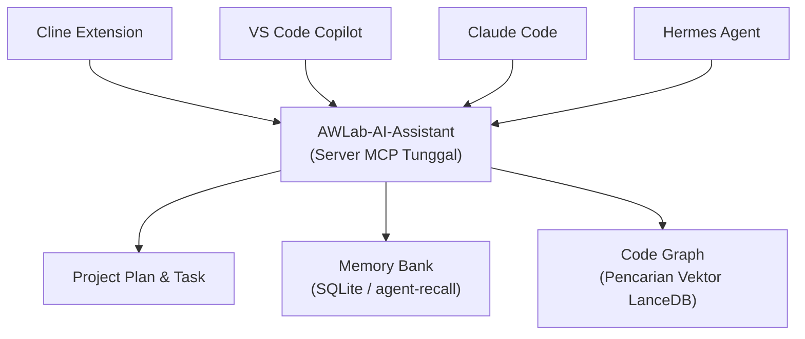
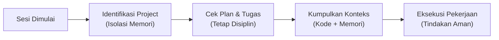

<p align="center">
  <strong>AWLab-AI-Assistant — AI-Assisted Development System</strong><br/>
  <em>Powered by AWLab-ID</em><br/>
  Rules · Workflows · Skills · One Deterministic MCP Server
</p>

<p align="center">
  <strong>🌐 Bahasa:</strong> <a href="README.md">English</a> · <a href="README_ID.md">Bahasa Indonesia</a>
</p>

<p align="center">
  
  
  
  
  
</p>

<p align="center">
  
  
</p>

<p align="center">
  <a href="#-tentang">Tentang</a> &bull;
  <a href="#️-arsitektur">Arsitektur</a> &bull;
  <a href="#️-cara-kerja">Cara Kerja</a> &bull;
  <a href="#-fitur">Fitur</a> &bull;
  <a href="#-supported-agent">Agent yang Didukung</a> &bull;
  <a href="#-dokumentasi">Dokumentasi</a> &bull;
  <a href="#-project-anda-tetap-bersih">Project Tetap Bersih</a> &bull;
  <a href="#-requirements">Persyaratan</a> &bull;
  <a href="#️-lisensi">Lisensi</a>
</p>

<p align="center">
  
</p>

---

## 💡 Tentang

AWLab-AI-Assistant meningkatkan kemampuan asisten AI Anda dengan memberikan **memori jangka panjang**, **kemampuan perencanaan strategis**, dan **pemahaman instan terhadap seluruh basis kode (codebase)**.

Kebanyakan asisten AI untuk coding memiliki rentang perhatian yang pendek: mereka melupakan konteks dari hari sebelumnya, kesulitan dalam menangani project besar, dan sering kali tersesat saat mengerjakan tugas kompleks tanpa perencanaan yang jelas.

AWLab-AI-Assistant menyelesaikan masalah ini dengan mengubah project biasa Anda menjadi **Lingkungan Pengembangan AI yang Project-Aware**. Kami menyediakan:

- **Koneksi Tunggal yang Andal (MCP)** — Alih-alih membingungkan AI dengan terlalu banyak alat, kami menyediakan satu antarmuka yang rapi. Ini mencegah AI berhalusinasi atau mengambil tindakan yang berisiko merusak kode Anda.
- **Perencanaan Strategis** — AI akan membuat, mengikuti, dan memperbarui rencana terstruktur untuk setiap tugas, sehingga AI tidak akan pernah kehilangan arah.
- **Arsitektur Otak Ganda (Dual-Brain)** —
  - **Memory Bank (SQLite):** Mengingat preferensi Anda, aturan, dan keputusan masa lalu di seluruh sesi.
  - **Code Graph (Graphify + LanceDB):** Secara instan memetakan dan memahami struktur kode Anda melalui vektor, sehingga AI tidak perlu membaca file satu per satu secara manual.

---

## 🏗️ Arsitektur

Gambaran singkat tentang bagaimana AI agent favorit Anda terhubung ke server cerdas kami:



---

## ⚙️ Cara Kerja

Setiap kali Anda memulai sesi baru, AI akan mengikuti alur yang sangat disiplin dan terprediksi:



1. **Sesi Dimulai** — Anda meminta AI agent untuk membuat fitur atau memperbaiki bug.
2. **Identifikasi Project** — AI memeriksa project mana yang sedang aktif untuk memastikan memori yang digunakan relevan dengan basis kode (codebase) ini.
3. **Cek Plan & Tugas** — AI membaca plan aktif untuk melanjutkan pekerjaan persis di mana ia berhenti sebelumnya.
4. **Kumpulkan Konteks** — Dalam satu langkah, server menggabungkan plan, tugas berikutnya, potongan kode yang relevan, dan instruksi Anda sebelumnya, sehingga AI mendapatkan konteks yang sempurna.
5. **Eksekusi Pekerjaan** — AI menggunakan tool yang aman dan teruji untuk menulis kode, memperbarui plan, dan menyimpan memori baru. Jika koneksi terputus, pekerjaan akan diantrekan secara aman (offline queue) dan dilanjutkan nanti!

---

## ✨ Fitur

| Fitur                        | Kenapa Anda akan menyukainya                                                                                                                                                                                |
| ---------------------------- | ----------------------------------------------------------------------------------------------------------------------------------------------------------------------------------------------------------- |
| **Fokus Penuh (Satu Tool)**  | AI hanya melihat satu tool utama. Hal ini menghilangkan kebingungan, penumpukan tool (tool sprawl), dan perilaku yang sulit diprediksi.                                                                     |
| **Manajer Tugas Bawaan**     | AI mengelola file `plan.md` dan `tasks.md` secara mandiri, serta secara teliti menandai tugas yang selesai agar tidak kehilangan arah.                                                                      |
| **Memori Ala Manusia**       | Didukung oleh backend SQLite `agent-recall`, AI dapat mengingat gaya coding Anda, bug masa lalu, dan keputusan arsitektur di setiap sesi.                                                                   |
| **Pembelajaran Pola**        | Sistem secara diam-diam mengamati bagaimana Anda mengoreksi AI. Jika Anda mengatakan "selalu gunakan X alih-alih Y", sistem akan menyimpan aturan tersebut dan menerapkannya secara otomatis di masa depan. |
| **Pemahaman Kode Instan**    | Menggunakan database vektor **LanceDB** lokal, server secara instan memetakan basis kode Anda (fungsi, kelas, file) sehingga AI dapat menemukan kode relevan dalam hitungan milidetik.                      |
| **Kecerdasan Multi-Project** | Bekerja pada frontend dan backend di folder terpisah? Keduanya dapat berbagi Code Graph dan Memory Bank yang saling terhubung.                                                                              |
| **Keamanan Mode Offline**    | Jika database sedang terkunci atau tidak tersedia, pemikiran dan memori AI akan disimpan di cache lokal, lalu disinkronkan saat kondisi sudah aman.                                                         |
| **Konteks Sekali Tarik**     | AI menarik seluruh konteks yang diperlukan (plan, tugas, kode, memori) dalam satu kali pemanggilan data yang terorkestrasi dengan baik.                                                                     |

---

## 🛡️ Performa & Proteksi Token

Arsitektur server MCP ini sangat dioptimalkan untuk melindungi batas konteks (context window) LLM Anda. Tidak ada jebakan pemborosan token (token burn):

1. **Parsing Plan Terstruktur (`ctx_info`)** — Alih-alih memasukkan seluruh `plan.md` ke dalam konteks setiap kali inisialisasi, `ctx_info` merangkum paragraf yang panjang dan hanya mengekstrak poin-poin penting seperti pendekatan, hasil yang diharapkan, dan pertanyaan yang belum terjawab (open questions).
2. **Pengembalian Graph (`graph_query`, `graph_explain`)** — Node yang dikembalikan oleh Code Graph **tidak** menyertakan raw source code (hanya ID, label, dan lokasi file). AI harus secara eksplisit meminta untuk membaca file tersebut, mencegah pemborosan token AST ke dalam prompt.
3. **Batas Ketat (Hard Limits)** — `graph_query` memiliki batas bawaan `limit=10`, `graph_explain` membatasi node tetangga hingga 30, dan `mem_search` maksimal 5-10 hasil.
4. **Inventaris Memori (`mem_list_entities`)** — Alih-alih mengembalikan seluruh entitas memori beserta riwayat observasinya, inventaris hanya menampilkan `{name, entityType, observation_count}`.

> [!TIP]
> **Didesain untuk Project Jangka Panjang:**
> AWLab-AI-Assistant menangani semua perlindungan token secara otomatis di belakang layar. Sistem ini secara dinamis memaksa AI agent untuk menghindari pembacaan file mentah berukuran besar, dan lebih bergantung pada endpoint yang dioptimalkan seperti `ctx_info`. Hal ini memastikan AI agent Anda tetap fokus dan produktif selama berbulan-bulan tanpa menghabiskan context window atau melambungkan tagihan API Anda!

---

## ✅ Agent yang Didukung

### AI Agent

Rules dan skill yang terkompilasi beserta server MCP telah diuji dan diverifikasi untuk agent berikut:

| Agent                                                                                                                    | Status     | Catatan                                                          |
| ------------------------------------------------------------------------------------------------------------------------ | ---------- | ---------------------------------------------------------------- |
| [Cline](https://github.com/cline/cline)                                                                                  | ✅ tested  | File rules `.md` terpisah di `~/Documents/Cline/Rules/`          |
| [VS Code Copilot](https://code.visualstudio.com/docs/copilot/overview)                                                   | ✅ tested  | File `.instructions.md` dengan frontmatter YAML                  |
| [Claude Code](https://docs.anthropic.com/en/docs/claude-code)                                                            | ✅ tested  | Satu file `CLAUDE.md` terpadu dengan anchor heading              |
| [Hermes Agent](https://github.com/nousresearch/hermes-agent)                                                             | ✅ tested  | Rules dikemas sebagai `awlab-rules/SKILL.md`                     |
| [OpenCode](https://opencode.ai)                                                                                          | 🆕 support | `AGENTS.md` global + skill di `~/.config/opencode/`              |
| [Google Antigravity](https://antigravity.google) / [Antigravity IDE](https://antigravity.google/product/antigravity-ide) | ✅ tested  | Modular rules di `~/.gemini/config/rules/` + skill + MCP + hooks |

### Sistem Operasi

Server MCP dapat di-build dan dijalankan di semua platform (build & usage tested):

| OS          | Build & Test |
| ----------- | ------------ |
| **Windows** | ✅ tested    |
| **Linux**   | ✅ tested    |
| **macOS**   | ✅ tested    |

---

## 📚 Dokumentasi

README ini adalah panduan utama. Gunakan tabel di bawah ini untuk menemukan dokumentasi yang lebih spesifik.

### Mau ke mana?

| Saya ingin…                                                           | Ke mana                                              |
| --------------------------------------------------------------------- | ---------------------------------------------------- |
| Memahami tentang project ini dan fitur-fiturnya                       | _(Anda sudah di sini — lanjut baca)_                 |
| Menginstal server MCP, mem-build, dan menghubungkannya ke AI agent    | [Instalasi & Penggunaan](docs/id/INSTALL.md)         |
| Melihat setiap aksi MCP (`action_call` / `action_help`) dan fungsinya | [Tool MCP yang Tersedia](docs/id/AVAILABLE_TOOLS.md) |
| Mengonfigurasi workspace multi-repo (unified graph & memory)          | [Project Families](docs/id/PROJECT_FAMILIES.md)      |
| Registrasi hook (opsional)                                            | [Registrasi Hook](docs/id/HOOKS.md)                  |
| Sinkronisasi memori agent antar perangkat via cloud (CRDT)            | [Dukungan Memori Cloud](docs/id/CRDT_SYNC.md)        |
| Baca versi Bahasa Inggris                                             | [README.md](README.md)                               |
| Riwayat perubahan                                                     | [CHANGELOG](CHANGELOG.md)                            |

### Daftar Dokumentasi

| Dokumen                                                      | Isi                                                                                                                                                                        |
| ------------------------------------------------------------ | -------------------------------------------------------------------------------------------------------------------------------------------------------------------------- |
| [`README_ID.md`](README_ID.md)                               | Tentang, fitur, OS/agent yang didukung, arsitektur (Bahasa Indonesia)                                                                                                      |
| [`README.md`](README.md)                                     | Tentang, fitur, OS/agent yang didukung, arsitektur (Bahasa Inggris)                                                                                                        |
| [`docs/id/CRDT_SYNC.md`](docs/id/CRDT_SYNC.md)               | Panduan eksperimental untuk mengaktifkan sinkronisasi memori CRDT melalui cloud                                                                                            |
| [`docs/id/INSTALL.md`](docs/id/INSTALL.md)                   | Persyaratan, instalasi dari source, build pasangan executable (bridge + worker), publikasi rules & skill, setup server MCP per agent, environment variables, referensi CLI |
| [`docs/id/AVAILABLE_TOOLS.md`](docs/id/AVAILABLE_TOOLS.md)   | Penjelasan 2 tool MCP utama dan **26 aksi** yang ditanganinya (plan, task, memory, graph, context, util, workflow), offline cache, serta multi-project                     |
| [`docs/id/PROJECT_FAMILIES.md`](docs/id/PROJECT_FAMILIES.md) | Dokumentasi konfigurasi project families untuk menggabungkan Code Graph dan memori di berbagai repository (multi-repo)                                                     |
| [`docs/id/HOOKS.md`](docs/id/HOOKS.md)                       | Automasi zero-LLM hook (opsional) — registrasi per-agent (Claude Code, Hermes, Cline, Copilot), event behavior, pro/kontra dibanding MCP, dan pemecahan masalah            |
| [`CHANGELOG.md`](CHANGELOG.md)                               | Catatan rilis untuk setiap versi                                                                                                                                           |

### Panduan Cepat (Pengguna Baru)

1. **Instal** paket dan (opsional) build pasangan executable (bridge + worker) — lihat [`docs/id/INSTALL.md`](docs/id/INSTALL.md#1-instal-server-mcp).
2. **Publikasikan** rules & skill yang sudah terkompilasi ke agent Anda — lihat [`docs/id/INSTALL.md`](docs/id/INSTALL.md#3-publikasikan-rules--skill-ke-agent-anda).
3. **Hubungkan** server MCP ke AI agent Anda — lihat [`docs/id/INSTALL.md`](docs/id/INSTALL.md#4-sambungkan-server-mcp).
4. **Jelajahi** tool dan fitur-fiturnya — lihat [`docs/id/AVAILABLE_TOOLS.md`](docs/id/AVAILABLE_TOOLS.md).

---

## 🧹 Project Anda Tetap Bersih

AWLab-AI-Assistant **AI-Assisted Development System** menyimpan **seluruh** state-nya secara rapi di dalam satu direktori `.ai/` di root project. Plan, memori, dan Code Graph agent Anda tidak akan membuang file sampah di repository Anda:

```
{root-project}/.ai/
├── project-id                   # ID identifikasi project saat ini (isolasi memori)
├── artifacts/                   # Direktori kumpulan plan, tugas, dan notes
│   ├── registry.md              # Registry pusat yang melacak semua UUID plan yang dibuat
│   └── {uuid}/                  # Direktori UUID berisi plan.md, tasks.md, notes.md
├── memory-bank/                 # Penyimpanan memori AI
│   ├── memory_{project-id}.db   # Database SQLite lokal untuk memori jangka panjang
│   ├── environment.md           # Informasi lingkungan project (tech stack)
│   ├── context.md               # Konteks hasil snapshot & orkestrasi
│   ├── observations.jsonl       # Pola pengguna (user patterns / habits)
│   └── pending.jsonl            # Antrean offline jika server MCP terputus
├── codegraph/                   # Code Graph (graph.json, graph.html, cache)
└── temp/                        # File sementara (mengikuti aturan hygiene file)
```

> [!TIP]
> **Tidak ada file sampah, tidak ada state yang berserakan** — semua yang dibuat oleh asisten AI berada secara terisolasi di dalam `.ai/`, sehingga repository Anda tetap bersih seperti yang Anda harapkan.

---

## 📋 Persyaratan

- **Python 3.10+** (untuk menjalankan server MCP)
- **agent-recall** (backend memori berbasis SQLite)
- **graphify** (pengindeks struktur code graph)
- Salah satu dari: **Cline**, **VS Code Copilot**, **Claude Code**, **Hermes Agent**, **OpenCode**, atau **Google Antigravity / Antigravity IDE**

---

## ⚖️ Lisensi

MIT — Bebas digunakan, dimodifikasi, dan dibagikan. Lihat [LICENSE](LICENSE) untuk detailnya.
