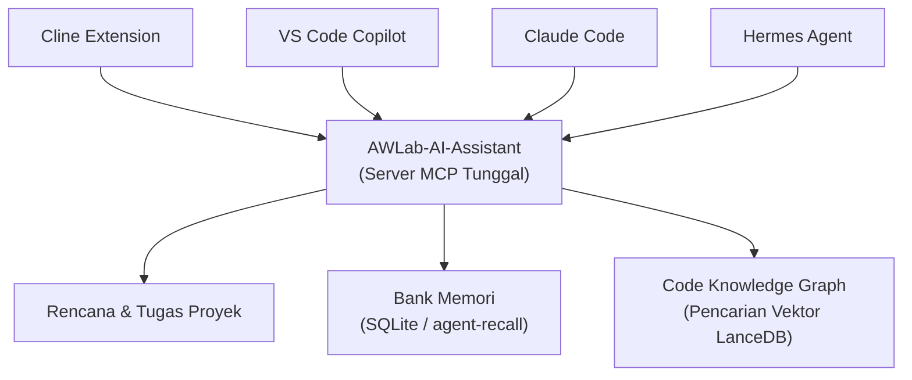
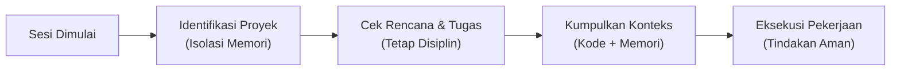

<p align="center">
  <strong>AWLab-AI-Assistant — AI-Assisted Development System</strong><br/>
  <em>Powered by AWLab-ID</em><br/>
  Rules · Workflows · Skills · One Deterministic MCP Server
</p>

<p align="center">
  <strong>🌐 Bahasa:</strong> <a href="README.md">English</a> · <a href="README_ID.md">Bahasa Indonesia</a>
</p>

<p align="center">
  
  
  
  
  
</p>

<p align="center">
  
  
</p>

<p align="center">
  <a href="#-about">About</a> &bull;
  <a href="#️-arsitektur">Arsitektur</a> &bull;
  <a href="#️-cara-kerja">Cara kerja</a> &bull;
  <a href="#-fitur">Fitur</a> &bull;
  <a href="#-supported-agent">Supported Agent</a> &bull;
  <a href="#-dokumentasi">Dokumentasi</a> &bull;
  <a href="#-project-anda-tetap-bersih">Project yang bersih</a> &bull;
  <a href="#-requirements">Requirements</a> &bull;
  <a href="#️-lisensi">Lisensi</a>
</p>

<p align="center">
  
</p>

---

## 💡 About

AWLab-AI-Assistant meningkatkan kemampuan asisten AI Anda dengan memberikannya **memori jangka panjang**, **kemampuan perencanaan strategis**, dan **pemahaman instan terhadap seluruh kode Anda**.

Kebanyakan asisten AI untuk coding memiliki rentang perhatian yang pendek: mereka melupakan apa yang Anda katakan kemarin, kebingungan menghadapi proyek yang besar, dan sering tersandung saat mengerjakan tugas kompleks tanpa perencanaan yang jelas.

AWLab-AI-Assistant menyelesaikan masalah ini dengan mengubah proyek biasa Anda menjadi **Lingkungan Pengembangan AI yang Sadar-Proyek**. Kami menyediakan:

- **Koneksi Tunggal yang Andal (MCP)** — Alih-alih membingungkan AI Anda dengan terlalu banyak alat, kami menyediakan satu antarmuka yang rapi. Ini mencegah AI berhalusinasi atau mengambil tindakan yang merusak kode Anda.
- **Perencanaan Strategis** — AI akan membuat, mengikuti, dan memperbarui rencana terstruktur untuk setiap tugas, memastikan ia tidak pernah kehilangan arah.
- **Arsitektur Otak Ganda (Dual-Brain)** —
  - **Bank Memori (SQLite):** Mengingat preferensi Anda, aturan, dan keputusan masa lalu di seluruh sesi.
  - **Code Knowledge Graph (Graphify + LanceDB):** Secara instan memetakan dan memahami struktur kode Anda melalui vektor, sehingga AI tidak perlu membaca setiap file secara manual.

---

## 🏗️ Arsitektur

Gambaran sederhana tentang bagaimana agen AI favorit Anda terhubung ke server cerdas kami:



---

## ⚙️ Cara kerja

Setiap kali Anda memulai sesi baru, AI mengikuti alur yang sangat disiplin dan terprediksi:



1. **Sesi Dimulai** — Anda meminta agen AI untuk membangun fitur atau memperbaiki bug.
2. **Identifikasi Proyek** — AI memeriksa proyek mana yang sedang dikerjakan untuk memastikan ia hanya menggunakan memori yang relevan dengan basis kode ini.
3. **Cek Rencana & Tugas** — AI membaca rencana aktif untuk melanjutkan tepat di tempat ia berhenti sebelumnya.
4. **Kumpulkan Konteks** — Dalam satu langkah, server menggabungkan rencana, tugas berikutnya, potongan kode yang relevan, dan instruksi masa lalu Anda, sehingga AI memiliki konteks yang sempurna.
5. **Eksekusi Pekerjaan** — AI menggunakan alat tervalidasi dan aman kami untuk menulis kode, memperbarui rencana, dan menyimpan memori baru. Jika koneksi terputus, pekerjaan dengan aman diantrekan dan dilanjutkan nanti!

---

## ✨ Fitur

| Fitur                       | Kenapa Anda akan menyukainya                                                                                                                                                                     |
| --------------------------- | ------------------------------------------------------------------------------------------------------------------------------------------------------------------------------------------------ |
| **Fokus Penuh (Satu Tool)** | AI hanya melihat satu alat utama, menghilangkan kebingungan, penumpukan alat (tool sprawl), dan perilaku yang tidak terprediksi.                                                                 |
| **Manajer Tugas Bawaan**    | AI memelihara dokumen `plan.md` dan `tasks.md` miliknya sendiri, dan dengan teliti mencentang tugas saat bekerja sehingga tidak pernah tersesat.                                                 |
| **Memori Ala Manusia**      | Menggunakan backend SQLite `agent-recall` kami, AI mengingat gaya koding Anda, bug masa lalu, dan keputusan arsitektur di setiap reboot.                                                         |
| **Pembelajaran Pola**       | Sistem secara diam-diam mengamati bagaimana Anda mengoreksi AI. Jika Anda bilang "selalu gunakan X alih-alih Y", sistem merekam aturan tersebut dan menerapkannya secara otomatis di masa depan. |
| **Pemahaman Kode Instan**   | Menggunakan database vektor lokal **LanceDB**, server secara instan memetakan basis kode Anda (fungsi, kelas, file) sehingga AI dapat menemukan kode relevan dalam hitungan milidetik.           |
| **Kecerdasan Multi-Proyek** | Bekerja pada frontend dan backend di folder terpisah? Keduanya bisa berbagi grafik kode (code graph) dan bank memori yang terhubung secara logis.                                                |
| **Keamanan Mode Offline**   | Jika database sedang terkunci atau tidak tersedia, pemikiran dan memori AI disimpan secara lokal (cache) dan disinkronkan saat kondisinya sudah aman.                                            |
| **Konteks Sekali Tarik**    | AI menarik seluruh konteks yang diperlukan (rencana, tugas, kode, memori) dalam satu pengambilan data yang terorkestrasi dengan sempurna.                                                        |

---

## 🛡️ Performa & Proteksi Token

Arsitektur server MCP ini sangat dioptimalkan untuk melindungi jendela konteks (context window) LLM Anda. Tidak ada jebakan token burn (pemborosan token) yang tidak disengaja:

1. **Parsing Rencana Struktural (`ctx_info`)** — Alih-alih memasukkan seluruh `plan.md` ke dalam konteks setiap kali inisialisasi, `ctx_info` memotong paragraf yang panjang dan hanya mengekstrak poin-poin penting (bullets) untuk approach, expected outcomes, dan open questions.
2. **Pengembalian Grafik (`graph_query`, `graph_explain`)** — Node yang dikembalikan oleh grafik **tidak** menyertakan potongan kode sumber mentah (hanya menyertakan ID, label, dan lokasi file). Agen harus secara eksplisit meminta untuk membaca file tersebut, mencegah pembuangan AST dalam jumlah besar ke dalam prompt.
3. **Batas Ketat (Hard Limits)** — `graph_query` memiliki batas bawaan `limit=10`, `graph_explain` membatasi tetangga (neighbors) hingga 30, dan `mem_search` maksimal 5-10 hasil.
4. **Inventaris Memori (`mem_list_entities`)** — Alih-alih mengembalikan seluruh entitas memori beserta riwayat observasinya, inventaris memotong output menjadi hanya `{name, entityType, observation_count}`.

> [!TIP]
> **Didesain untuk Proyek Jangka Panjang:**
> AWLab-AI-Assistant menangani semua perlindungan token secara otomatis di balik layar. Sistem ini secara dinamis menegakkan protokol yang menginstruksikan agen AI untuk menghindari pembacaan file mentah berukuran besar dan sebaliknya bergantung pada endpoint yang dioptimalkan seperti `ctx_info`. Ini memastikan agen Anda tetap fokus dan produktif selama berbulan-bulan tanpa menghabiskan batas penggunaan konteks (context window) atau melambungkan tagihan API Anda!

---

## ✅ Supported Agent

### Agent AI yang didukung

Rules + skill yang terkompilasi dan server MCP sudah terverifikasi (tested) pada kelima agent:

| Agent                                                                                                                    | Status     | Catatan                                                          |
| ------------------------------------------------------------------------------------------------------------------------ | ---------- | ---------------------------------------------------------------- |
| [Cline](https://github.com/cline/cline)                                                                                  | ✅ tested  | File rules `.md` terpisah di `~/Documents/Cline/Rules/`          |
| [VS Code Copilot](https://code.visualstudio.com/docs/copilot/overview)                                                   | ✅ tested  | File `.instructions.md` dengan frontmatter YAML                  |
| [Claude Code](https://docs.anthropic.com/en/docs/claude-code)                                                            | ✅ tested  | Satu monolit `CLAUDE.md` dengan anchor heading                   |
| [Hermes Agent](https://github.com/nousresearch/hermes-agent)                                                             | ✅ tested  | Rules dikemas sebagai `awlab-rules/SKILL.md`                     |
| [OpenCode](https://opencode.ai)                                                                                          | 🆕 support | `AGENTS.md` global + skill di `~/.config/opencode/`              |
| [Google Antigravity](https://antigravity.google) / [Antigravity IDE](https://antigravity.google/product/antigravity-ide) | ✅ tested  | Modular rules di `~/.gemini/config/rules/` + skill + MCP + hooks |

### Sistem operasi yang didukung

Mcp server bisa di-build dan dijalankan di semua platform (build & usage tested):

| OS          | Build & Test |
| ----------- | ------------ |
| **Windows** | ✅ tested    |
| **Linux**   | ✅ tested    |
| **macOS**   | ✅ tested    |

---

## 📚 Dokumentasi

README ini adalah sumber dokumentasi awal. Gunakan tabel di bawah untuk menemukan halaman lainnya.

### Mau ke mana?

| Saya ingin…                                                                  | Ke mana                                              |
| ---------------------------------------------------------------------------- | ---------------------------------------------------- |
| Memahami tentang project ini dan fiturnya                                    | _(Anda sudah di sini — lanjut baca)_                 |
| Menginstal server MCP, membuild-nya, dan menyambungkannya ke agent AI        | [Instal & Terapkan](docs/id/INSTALL.md)              |
| Melihat setiap action dari MCP (`action_call` / `action_help`) dan fungsinya | [Tool MCP yang Tersedia](docs/id/AVAILABLE_TOOLS.md) |
| Konfigurasi ruang kerja multi-repositori (unified graph & memory)            | [Project Families](docs/id/PROJECT_FAMILIES.md)      |
| Registrasi hook (opsional)                                                   | [Registrasi Hook](docs/id/HOOKS.md)                  |
| Sinkronisasi memori agent antar perangkat via cloud (cr-sqlite)              | [Dukungan Memori Cloud](docs/id/CRDT_SYNC.md)        |
| Baca versi Bahasa Inggris                                                    | [README.md](README.md)                               |
| Riwayat perubahan                                                            | [CHANGELOG](CHANGELOG.md)                            |

### Daftar Dokumentasi

| Dokumen                                                      | Isi                                                                                                                                                                 |
| ------------------------------------------------------------ | ------------------------------------------------------------------------------------------------------------------------------------------------------------------- |
| [`README_ID.md`](README_ID.md)                               | About, fitur, OS/agent yang diuji, arsitektur (Bahasa Indonesia)                                                                                                    |
| [`README.md`](README.md)                                     | About, fitur, OS/agent yang diuji, arsitektur (Bahasa Inggris)                                                                                                      |
| [`docs/id/CRDT_SYNC.md`](docs/id/CRDT_SYNC.md)               | Panduan eksperimental untuk mengaktifkan sinkronisasi memori CRDT melalui cloud                                                                                     |
| [`docs/id/INSTALL.md`](docs/id/INSTALL.md)                   | Persyaratan, instal dari source, membangun pasangan executable (bridge + worker), publikasi rules + skill, implementasi server MCP per agent, variabel penggunaan, referensi CLI           |
| [`docs/id/AVAILABLE_TOOLS.md`](docs/id/AVAILABLE_TOOLS.md)   | 2 tool MCP yang tersedia dan **23 action** yang ditanganinya (plan, task, memory, graph, context, util, workflow), graph, cache offline, dan multi project          |
| [`docs/id/PROJECT_FAMILIES.md`](docs/id/PROJECT_FAMILIES.md) | Dokumentasi untuk mengonfigurasi keluarga proyek (project families) guna menggabungkan grafik kode dan berbagi memori episodik lintas repositori                    |
| [`docs/id/HOOKS.md`](docs/id/HOOKS.md)                       | Otomasi hook zero-LLM opsional — registrasi per-agent (Claude Code, Hermes, Cline, Copilot), perilaku event, pro/kontra vs MCP-saja, verifikasi & pemecahan masalah |
| [`CHANGELOG.md`](CHANGELOG.md)                               | Catatan rilis per versi                                                                                                                                             |

### Jalur tercepat (pengguna baru)

1. **Instal** paketnya dan (opsional) membangun pasangan executable (bridge + worker) — lihat [`docs/id/INSTALL.md`](docs/id/INSTALL.md#1-instal-server-mcp).
2. **Publikasikan** rules + skill terkompilasi ke agent Anda — lihat [`docs/id/INSTALL.md`](docs/id/INSTALL.md#3-publikasikan-rules--skill-ke-agent-anda).
3. **Sambungkan** server MCP ke agent Anda — lihat [`docs/id/INSTALL.md`](docs/id/INSTALL.md#4-sambungkan-server-mcp).
4. **Jelajahi** tool dan fiturnya — lihat [`docs/id/AVAILABLE_TOOLS.md`](docs/id/AVAILABLE_TOOLS.md).

---

## 🧹 Project Anda tetap bersih

AWLab-AI-Assistant **AI-Assisted Development System** menyimpan **semua** state-nya di dalam satu direktori `.ai/` di root project — plan, memori, dan code graph agent tidak akan membuat file yang tidak diperlukan di repositori Anda:

```
{root-project}/.ai/
├── project-id                   # ID untuk identifikasi project yang sedang berjalan (isolasi memori)
├── artifacts/                   # Artefak plan sebagai direktori untuk kumpulan plan, tasks, dan notes
│   ├── registry.md              # Registry plan sebagai pusat registry dari uuid plan yang dibuat
│   └── {uuid}/                  # UUID directory yang berisi plan.md, tasks.md, notes.md
├── memory-bank/                 # Folder khusus untuk penyimpanan yang berkaitan dengan memori
│   ├── memory_{project-id}.db   # Database berbasis SQLite untuk menyimpan memori
│   ├── environment.md           # Informasi terkait project (tech stack)
│   ├── context.md               # Hasil snapshot & orkestrasi
│   ├── observations.jsonl       # User pattern (pola kebiasaan user)
│   └── pending.jsonl            # Berisi queue offline ketika mcp server tidak dapat dijangkau
├── codegraph/                   # Code knowledge graph (graph.json, graph.html, cache)
└── temp/                        # File scratch/temp — mengikuti file-hygiene rule
```

> [!TIP]
> **Tidak ada file sampah, tidak ada status (state) yang berserakan** — semua yang dibuat oleh asisten AI hidup di dalam `.ai/`, jadi source tree Anda tetap persis seperti yang Anda harapkan.

---

## 📋 Requirements

- **Python 3.10+** (untuk server MCP)
- **agent-recall** (backend memori knowledge-graph)
- **graphify** (pengindeks code knowledge-graph)
- Salah satu dari: **Cline**, **VS Code Copilot**, **Claude Code**, **Hermes Agent**, **OpenCode**, atau **Google Antigravity / Antigravity IDE**

---

## ⚖️ Lisensi

MIT — Bebas digunakan, diubah, dan dibagikan. Lihat [LICENSE](LICENSE).
