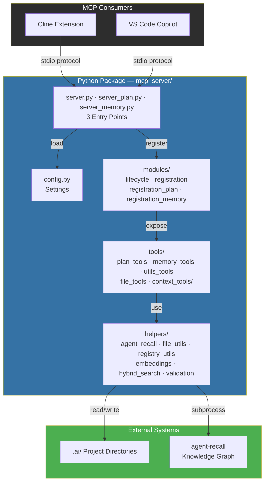
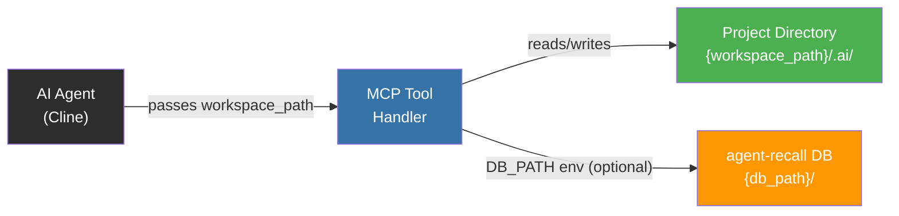

# AWLab-ID MCP Server

**Deterministic MCP server providing 36 tools across 3 standalone servers for plan management, memory operations, registry control, workflow execution, and project scanning — all without AI model invocation.**

Part of the [cline-ai-assisted-dev](../) system.

| Server | Tools | Entry Point |
|--------|-------|-------------|
| `awlab-mcp` | 6 utility & context tools | `server.py` / `__main__.py` |
| `awlab-plan` | 17 plan, registry, task & workflow tools | `server_plan.py` / `__main_plan__.py` |
| `awlab-memory` | 13 memory & context store tools | `server_memory.py` / `__main_memory__.py` |

---

## Architecture



---

## Parameter-Driven Architecture (No Auto-Detection)

All file-operating MCP tools accept an explicit **`workspace_path`** parameter — the AI Agent is responsible for passing the correct workspace root. The server performs **no automatic detection** of the project root.



**Key design decisions:**
- **No workspace auto-detection.** The server never inspects env vars, process trees, or CWD to resolve the project root.
- **`workspace_path` is required** for all tools that operate on disk (plans, registry, memory bank, scanning).
- **`DB_PATH` is the only env-based config** — it overrides the agent-recall database location. If unset, the caller must provide a workspace path at the call site.
- **`get_project_id` MCP tool is removed.** To get the project ID, read `.ai/project-id` directly via `read_memory_bank` or other file-reading tools.
- **`psutil` dependency is removed.** No process inspection is performed.

---

## Installation

### Via pip (recommended)

```bash
# From project root
pip install -e .
# Now `awlab-mcp` is available as a CLI command
```

### Build standalone executables

```bash
# Build for current OS (uses PyInstaller via scripts/run.py)
python scripts/run.py build
# Build for specific targets
python scripts/run.py build --target-os=all
python scripts/run.py build --target-os=linux
```

Built binaries at `dist/bin/awlab-mcp.exe`, `dist/bin/awlab-plan.exe`, `dist/bin/awlab-memory.exe`.

### Configure in Cline

```json
{
  "mcpServers": {
    "awlab-mcp": {
      "type": "stdio",
      "command": "path_to/dist/awlab-mcp.exe",
      "env": {
        "LOG_ENABLED": "true",
        "LOG_LEVEL": "INFO"
      }
    },
    "awlab-plan": {
      "type": "stdio",
      "command": "path_to/dist/awlab-plan.exe",
      "env": {
        "LOG_ENABLED": "true",
        "LOG_LEVEL": "INFO"
      }
    },
    "awlab-memory": {
      "type": "stdio",
      "command": "path_to/dist/awlab-memory.exe",
      "env": {
        "LOG_ENABLED": "true",
        "LOG_LEVEL": "INFO"
      }
    }
  }
}
```

**Alternative entry points** (use any one):

| Server | Entry Point | `command` | `args` |
|--------|-------------|-----------|--------|
| `awlab-mcp` | Installed CLI | `.venv\Scripts\awlab-mcp.exe` | *(none)* |
| `awlab-mcp` | Python module | `.venv\Scripts\python.exe` | `["-m", "mcp_server"]` |
| `awlab-plan` | Installed CLI | `.venv\Scripts\awlab-plan.exe` | *(none)* |
| `awlab-plan` | Python module | `.venv\Scripts\python.exe` | `["-m", "mcp_server.server_plan"]` |
| `awlab-memory` | Installed CLI | `.venv\Scripts\awlab-memory.exe` | *(none)* |
| `awlab-memory` | Python module | `.venv\Scripts\python.exe` | `["-m", "mcp_server.server_memory"]` |

---

## Tools Reference (36 tools across 3 servers)

### 🔧 awlab-mcp (6 tools — Utility & Context)

| Tool | Description |
|------|-------------|
| `util_get_version` | Return MCP server build version & tag |
| `util_get_project_meta` | Return OS, shell, server version, workspace metadata |
| `ctx_get_snapshot` | Active plan + patterns + project ID snapshot |
| `ctx_read_memory_bank` | Read allowed files from `.ai/memory-bank/` |
| `ctx_scan_project` | Framework-aware project scan (entry points, relationships) |
| `ctx_suggest_files` | Suggest relevant files for a task description |

### 📋 awlab-plan (17 tools — Registry, Tasks & Workflows)

**Registry Lifecycle**

| Tool | Description |
|------|-------------|
| `reg_list_registry` | Return Active/Paused/Completed plans as JSON |
| `reg_switch_active_plan` | Change the active plan UUID in the registry |
| `reg_validate_phase_gate` | Check if predecessor phase is complete |
| `reg_get_next_eligible_task` | Find next non-blocked, non-terminal task |
| `reg_mark_phase_complete` | Mark all tasks in a phase as completed |
| `reg_resolve_deferred_tasks` | Re-evaluate ⏳ deferred tasks |
| `reg_check_plan_completable` | Verify all tasks are in terminal states |
| `reg_generate_retrospective` | Extract patterns from a completed plan |

**Task Management**

| Tool | Description |
|------|-------------|
| `task_read_plan_tasks` | Parse `tasks.md` into structured/raw/minimal JSON |
| `task_write_plan_tasks` | Write markdown content to `tasks.md` |
| `task_update_status` | Update a single task's status marker |
| `task_batch_update` | Atomically update multiple tasks with rollback |
| `task_validate_transition` | Check if a status marker transition is legal |
| `task_format_markdown` | Format task list as markdown |

**Workflows & Utilities**

| Tool | Description |
|------|-------------|
| `wf_execute` | Execute a named workflow from `Cline/Workflows/` |
| `wf_list` | List available workflow files |
| `util_generate_mermaid` | Generate Mermaid flowchart from phases |

### 🧠 awlab-memory (13 tools — Memory & Context Store)

**Knowledge Graph**

| Tool | Description |
|------|-------------|
| `mem_search` | Hybrid BM25+dense search (supports scope + project_id) |
| `mem_store` | Store an observation (auto-creates entity if needed) |
| `mem_create_entities` | Create new entities (people, concepts, patterns) |
| `mem_tag_entity` | Attach context labels to an existing entity |
| `mem_relate` | Declare a semantic association between entities |
| `mem_fetch_node_details` | Query specific attributes of graph nodes |
| `mem_read_graph` | Read the knowledge graph neighbourhood |
| `mem_archive_entities` | Move entities to historical archive state |
| `mem_delete_observations` | Remove specific observations from entities |
| `mem_delete_relations` | Remove relations between entities |
| `mem_list_patterns` | List all stored patterns |

**Context Store (TTL-based)**

| Tool | Description |
|------|-------------|
| `ctx_store` | Store context fragments with TTL-based expiry |
| `ctx_get_fragment` | Retrieve topic-specific context without file reads |

---

## Configuration

| Variable | Description | Default |
|----------|-------------|---------|
| `DB_PATH` | Override agent-recall database directory | *(workspace_path/.ai/memory/)* |
| `AGENT_RECALL_CMD` | Override agent-recall executable path | *(auto-detected from `.venv`)* |
| `LOG_ENABLED` | Enable/disable logging | `false` |
| `LOG_LEVEL` | Logging verbosity (`INFO`, `DEBUG`) | `INFO` |

Copy `.env` (or `config.json`) in the production config home `~/.awlab-id/agent-memory/` or project root to customize:

```
AWLAB_ENV=production        # Force production mode
LOG_ENABLED=true
LOG_LEVEL=INFO
DB_PATH=C:\custom\memory     # Override agent-recall DB location
```

---

## Directory Structure

```
mcp_server/
├── __init__.py
├── _version.py             # Version string (v1.1.0+build.065)
├── server.py               # FastMCP entry point — awlab-mcp (6 tools)
├── server_plan.py          # FastMCP entry point — awlab-plan (17 tools)
├── server_memory.py        # FastMCP entry point — awlab-memory (13 tools)
├── __main__.py             # Thin CLI entry point (awlab-mcp)
├── __main_plan__.py        # CLI entry point (awlab-plan)
├── __main_memory__.py      # CLI entry point (awlab-memory)
├── config.py               # Settings — prod/dev detection, .env + config.json
├── README.md               # This file
├── tools/
│   ├── __init__.py
│   ├── plan_tools.py       # Plan & task management
│   ├── memory_tools.py     # Memory operations
│   ├── utils_tools.py      # Utility functions
│   ├── file_tools.py       # File reading operations
│   └── context_tools/      # Context, scanning, caching, suggestions
│       ├── __init__.py
│       ├── context.py
│       ├── scanner.py
│       ├── suggest.py
│       ├── _cache.py
│       └── _memory_search.py
├── helpers/
│   ├── __init__.py         # Re-exports all helpers
│   ├── agent_recall.py     # agent-recall subprocess wrapper
│   ├── file_utils.py       # File I/O and markdown parsing
│   ├── registry_utils.py   # Registry.md parsing and updating
│   ├── embeddings.py       # FastEmbed integration (optional)
│   ├── hybrid_search.py    # BM25 + dense re-ranking
│   ├── logger.py           # Professional logger with tool scoping
│   ├── validation.py       # UUID, status, phase validation
│   ├── response.py         # JSON response helpers
│   └── workspace.py        # DB path resolution
└── modules/
    ├── __init__.py
    ├── lifecycle.py        # Server lifecycle — FastMCP app + run_server()
    ├── registration.py     # Tool registration — awlab-mcp tools
    ├── registration_plan.py  # Tool registration — awlab-plan tools
    └── registration_memory.py # Tool registration — awlab-memory tools
```

---

## Error Handling

All tools return JSON strings. Successful responses include `"success": true` where applicable. On error, a descriptive `"error"` field is returned. The server never crashes — errors are logged to stderr to avoid interfering with the MCP protocol.

## Logging

Log output goes to **stderr** (not stdout), preventing interference with the MCP protocol's JSON messages on stdout. Set `LOG_LEVEL=DEBUG` in `.env` for verbose logging.

---

## Requirements

- Python 3.10+
- `mcp>=1.0.0`, `pydantic>=2.0`, `python-dotenv>=1.0`
- `httpx>=0.28` (for agent-recall subprocess)
- Optional: `fastembed>=0.5.0` (for BM25+dense hybrid search)

