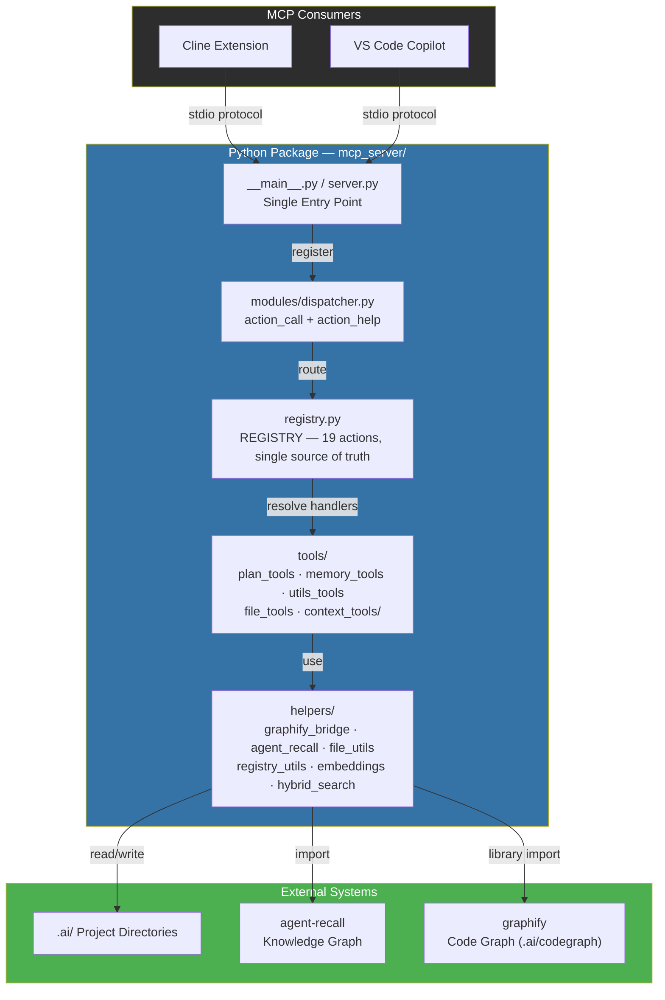
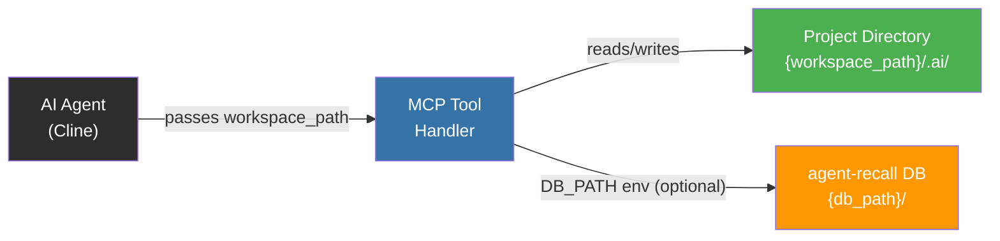

# AWLab-ID MCP Server

**Deterministic MCP server — a single executable exposing exactly 2 tools (`action_call`, `action_help`) that route 19 actions across plan management, memory operations, registry control, workflow execution, project scanning, project families, the offline cache, and the code knowledge graph — all without AI model invocation.**

Part of the [cline-ai-assisted-dev](../) system.

| Server | MCP tools | Actions (via `action_call`) | Entry Point |
|--------|-----------|------------------------------|-------------|
| `awlab-mcp` | `action_call` + `action_help` | 19 (`task_*`, `plan_*`, `mem_*`, `graph_*`, `ctx_*`, `util_*`, `wf`) | `server.py` / `__main__.py` |

---

## Architecture



---

## Parameter-Driven Architecture (No Auto-Detection)

All file-operating actions accept an explicit **`workspace_path`** parameter — the AI Agent is responsible for passing the correct workspace root. The server performs **no automatic detection** of the project root.



**Key design decisions:**
- **No workspace auto-detection.** The server never inspects env vars, process trees, or CWD to resolve the project root.
- **`workspace_path` is required** for all tools that operate on disk (plans, registry, memory bank, scanning).
- **Env vars are optional** — the server runs with sensible defaults. See [Configuration](#configuration) below.
- **`DB_PATH`** overrides the agent-recall database location; when unset the caller must provide a workspace path at the call site.
- **`get_project_id` MCP tool is removed.** To get the project ID, read `.ai/project-id` via `ctx_info mode="memory_bank"`.
- **`psutil` dependency is removed.** No process inspection is performed.

---

## Installation

### Via pip (recommended)

```bash
# From project root
pip install -e .
# Now `awlab-mcp` is available as a CLI command
```

### Build standalone executables

```bash
# Build for current OS (uses PyInstaller via scripts/run.py)
python scripts/run.py build
# Build for specific targets
python scripts/run.py build --target-os=all
python scripts/run.py build --target-os=linux
```

Built executable at `dist/bin/awlab-mcp.exe` (Windows) / `dist/bin/awlab-mcp` (Linux/macOS) — a single binary for all platforms.

### Configure in Cline

```json
{
  "mcpServers": {
    "awlab-mcp": {
      "type": "stdio",
      "command": "path_to/dist/awlab-mcp.exe",
      "env": {
        "LOG_ENABLED": "true",
        "LOG_LEVEL": "INFO"
      }
    }
  }
}
```

**Alternative entry points** (use any one):

| Server | Entry Point | `command` | `args` |
|--------|-------------|-----------|--------|
| `awlab-mcp` | Installed CLI | `.venv\Scripts\awlab-mcp.exe` | *(none)* |
| `awlab-mcp` | Python module | `.venv\Scripts\python.exe` | `["-m", "mcp_server"]` |
| `awlab-mcp` | Built executable | `dist/bin/awlab-mcp.exe` | *(none)* |

---

## Tools Reference — action_call dispatcher (19 actions)

Two MCP tools are exposed:

| MCP tool | Description |
|----------|-------------|
| `action_call(action, params?)` | Route any REGISTRY action; runs preconditions (idempotent) + pipeline (ordered) then the handler; returns `{success, action, result, executed, skipped}` |
| `action_help(action?)` | Per-action usage (params, defaults, example, errors, preconditions, pipeline) or grouped overview |

### Actions by group

**📋 Plan / Registry / Tasks**

| Action | Description |
|--------|-------------|
| `task_read` | Parse `tasks.md` into structured/raw/minimal JSON |
| `task_update` | Update task status (multi-level paths) with atomic rollback |
| `plan_status` | Registry + next-eligible task + phase gate + completable check |
| `plan_update` | Switch active plan / mark phase complete / resolve deferred tasks |
| `wf` | List or execute named workflows |

**🧠 Memory**

| Action | Description |
|--------|-------------|
| `mem_search` | Hybrid BM25+dense search (scope + project_id) |
| `mem_write` | Create/tag/relate/store observations + entities |
| `mem_read` | Node details or graph neighbourhood |
| `mem_remove` | Archive entities / delete observations / delete relations |
| `mem_list_entities` | Inventory all memory entities (name/type/obs count) for auditing |
| `mem_dedupe` | Merge same-named entities (keep data-bearing, archive dupes) |
| `mem_replay` | Replay the offline cache (`pending.jsonl`) — re-apply queued mutations |

**🕸️ Code Knowledge Graph**

| Action | Description |
|--------|-------------|
| `graph_build` | Build the code graph into `<root>/.ai/codegraph/` (AST-only, no LLM) |
| `graph_status` | Freshness check {fresh, last_built, changed_files} |
| `graph_query` | Search graph nodes by label/source/type |
| `graph_path` | Shortest path (BFS) between two nodes |
| `graph_explain` | Node details + direct neighbours with relations |

**⚙️ Context / Util**

| Action | Description |
|--------|-------------|
| `ctx_info` | Active plan + patterns + project ID snapshot |
| `util_info` | OS, shell, server version, build metadata |

---

## Configuration

| Variable | Description | Default |
|----------|-------------|---------|
| `AWLAB_ENV` | Force `production`/`development` mode (else auto-detected from PyInstaller exe) | auto |
| `LOG_ENABLED` | Enable/disable file logging (`true`/`1`/`yes`) | `true` |
| `LOG_LEVEL` | Logging verbosity (`info`, `debug`) | `info` |
| `DB_PATH` | Override agent-recall database directory | *(workspace_path/.ai/memory/)* |
| `GRAPH_PARALLEL` | Opt-in parallel graph extraction (see docs/INSTALL.md) | `false` |

Copy `.env` (or `config.json`) in the production config home `~/.awlab-id/agent-memory/` or project root to customize:

```
AWLAB_ENV=production        # Force production mode
LOG_ENABLED=true
LOG_LEVEL=INFO
DB_PATH=C:\custom\memory     # Override agent-recall DB location
GRAPH_PARALLEL=false        # Sequential extraction (default, recommended)
```

---

## Directory Structure

```
mcp_server/
├── __init__.py
├── _version.py             # Version string (v3.0.1+build.093)
├── server.py               # Dev console entry (awlab-mcp)
├── __main__.py             # PyInstaller entry — single executable
├── registry.py             # REGISTRY — 19 actions, single source of truth
├── config.py               # Settings — prod/dev detection, .env + config.json
├── README.md               # This file
├── tools/
│   ├── __init__.py
│   ├── plan_tools/         # Plan & task management
│   ├── memory_tools.py     # Memory operations
│   ├── utils_tools.py      # Utility functions
│   ├── file_tools.py       # File reading operations
│   └── context_tools/      # Context, scanning, caching, suggestions
│       ├── __init__.py
│       ├── context.py
│       ├── scanner.py
│       ├── suggest.py
│       ├── _cache.py
│       ├── _memory_search.py
│       └── _registry_parser.py
├── helpers/
│   ├── __init__.py         # Re-exports all helpers
│   ├── agent_recall.py     # agent-recall bridge (library import)
│   ├── graphify_bridge.py  # Code knowledge graph (graphifyy, AST-only)
│   ├── file_utils.py       # File I/O and markdown parsing
│   ├── registry_utils.py   # Registry.md parsing and updating
│   ├── embeddings.py       # FastEmbed integration
│   ├── hybrid_search.py    # BM25 + dense re-ranking
│   ├── logger.py           # Professional logger with tool scoping
│   ├── validation.py       # UUID, status, phase validation
│   ├── response.py         # JSON response helpers
│   └── workspace.py        # DB path resolution
└── modules/
    ├── __init__.py
    ├── lifecycle.py        # Server lifecycle — FastMCP app + run_server()
    ├── dispatcher.py       # action_call + action_help (routes via REGISTRY)
    └── registration.py     # Tool registration — registers the dispatcher
```

---

## Error Handling

All tools return JSON strings. Successful responses include `"success": true` where applicable. On error, a descriptive `"error"` field is returned. The server never crashes — errors are logged to stderr to avoid interfering with the MCP protocol.

## Logging

Log output goes to **stderr** (not stdout), preventing interference with the MCP protocol's JSON messages on stdout. Set `LOG_LEVEL=DEBUG` in `.env` for verbose logging.

---

## Requirements

- Python 3.10+
- `mcp>=1.0.0`, `pydantic>=2.0`, `python-dotenv>=1.0`
- `httpx>=0.28` (for agent-recall subprocess)
- Optional: `fastembed>=0.5.0` (for BM25+dense hybrid search)

