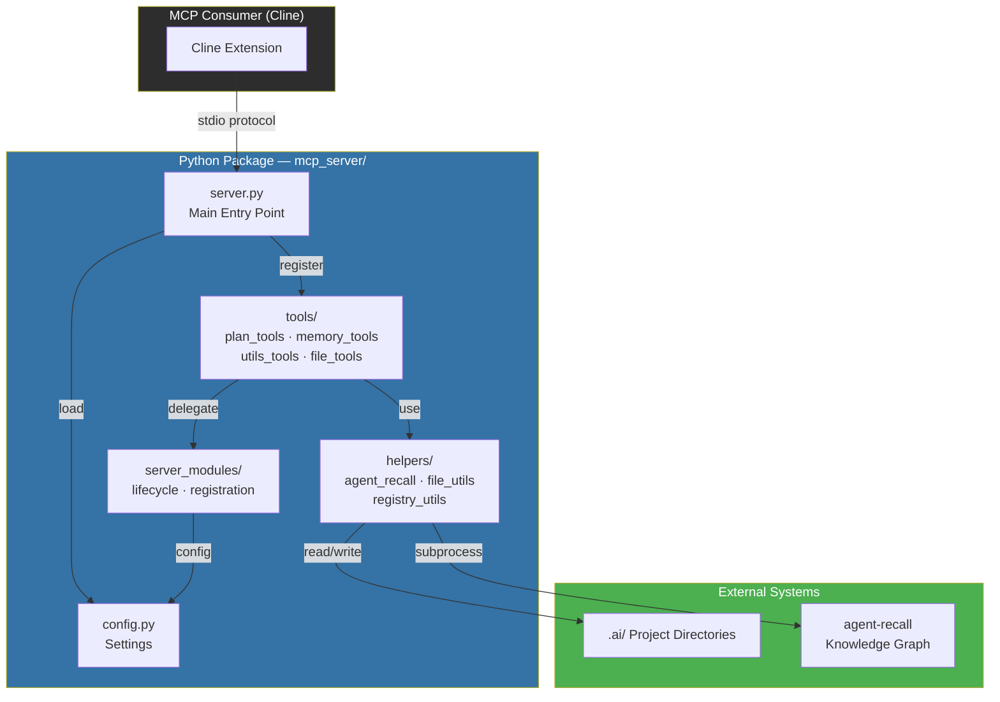
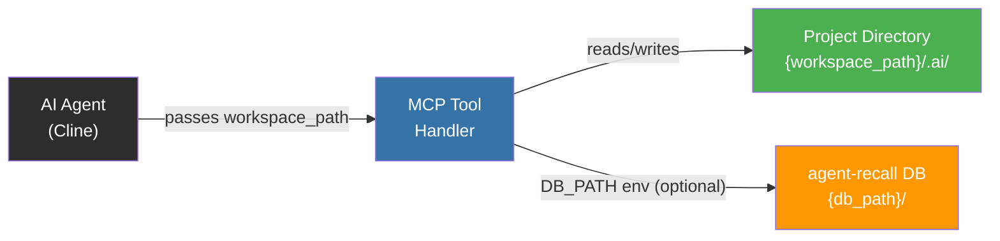

# AWLab-ID MCP Server

**Deterministic MCP server providing 40+ tools for plan management, memory operations, registry control, workflow execution, and project scanning — all without AI model invocation.**

Part of the [cline-ai-assisted-dev](../) system.

---

## Architecture



---

## Parameter-Driven Architecture (No Auto-Detection)

All file-operating MCP tools accept an explicit **`workspace_path`** parameter — the AI Agent is responsible for passing the correct workspace root. The server performs **no automatic detection** of the project root.



**Key design decisions:**
- **No workspace auto-detection.** The server never inspects env vars, process trees, or CWD to resolve the project root.
- **`workspace_path` is required** for all tools that operate on disk (plans, registry, memory bank, scanning).
- **`DB_PATH` is the only env-based config** — it overrides the agent-recall database location. If unset, the caller must provide a workspace path at the call site.
- **`get_project_id` MCP tool is removed.** To get the project ID, read `.ai/project-id` directly via `read_memory_bank` or other file-reading tools.
- **`psutil` dependency is removed.** No process inspection is performed.

---

## Installation

### Via pip (recommended)

```bash
# From project root
pip install -e .
# Now `awlab-mcp` is available as a CLI command
```

### Manual (no install required)

```bash
pip install -r mcp_server/requirements.txt
```

### Configure in Cline

```json
{
  "mcpServers": {
    "agent-memory": {
      "type": "stdio",
      "command": "D:\\Project\\IDE\\cline-ai-assisted-dev\\.venv\\Scripts\\awlab-mcp.exe",
      "env": {
        "LOG_ENABLED": "true",
        "LOG_LEVEL": "INFO"
      }
    }
  }
}
```

**Alternative entry points** (use any one):

| Entry Point | `command` | `args` |
|-------------|-----------|--------|
| Installed CLI | `.venv\Scripts\awlab-mcp.exe` | *(none)* |
| Python module | `.venv\Scripts\python.exe` | `["-m", "mcp_server.server"]` |

---

## Tools Reference (40+)

### 📋 Plan & Task Management

| Tool | Description | Input |
|------|-------------|-------|
| `read_plan_tasks` | Parse a plan's `tasks.md` into structured JSON | `plan_uuid: str`, `workspace_path: str`, `format?` ("structured"/"raw"/"minimal") |
| `update_task_status` | Update a single task's status marker | `plan_uuid`, `task_path`, `new_status`, `workspace_path` |
| `batch_update_tasks` | Atomically update multiple tasks with rollback | `plan_uuid`, `updates: str`, `workspace_path` |
| `validate_phase_gate` | Check if Phase{N-1} is complete before Phase{N} | `plan_uuid`, `phase_num`, `workspace_path` |
| `get_next_eligible_task` | Find the next non-blocked task respecting dependencies | `plan_uuid`, `workspace_path`, `phase?` |
| `validate_status_transition` | Check if a status transition is legal | `current`, `target` status markers |
| `mark_phase_complete` | Complete all tasks in a phase (8-step workflow) | `plan_uuid`, `phase_number`, `workspace_path` |
| `resolve_deferred_tasks` | Re-evaluate ⏳ tasks whose dependencies are now met | `plan_uuid`, `workspace_path`, `phase_number?` |
| `check_plan_completable` | Verify all tasks are in terminal states | `plan_uuid`, `workspace_path` |

### 📂 Registry & Plan Lifecycle

| Tool | Description | Input |
|------|-------------|-------|
| `list_registry` | Return Active/Paused/Completed tables as JSON | `workspace_path` |
| `switch_active_plan` | Change the active plan UUID in the registry | `uuid`, `workspace_path` |
| `generate_retrospective_summary` | Extract patterns from a completed plan | `plan_uuid`, `workspace_path` |
| `format_tasks_as_markdown` | Convert structured task data to markdown | `plan_uuid?` or `phases?`, `workspace_path?` |

### 🧠 Memory & Knowledge Graph

| Tool | Description | Input |
|------|-------------|-------|
| `search_nodes` | Hybrid search across project-scoped entities | `query`, `limit?` (default 10) |
| `create_entities` | Create new entities (people, concepts, patterns) | `entities: list[{name, entityType, observations?}]` |
| `add_observations` | Attach facts to existing entities | `observations: list[{entityName, contents}]` |
| `create_relations` | Link two entities with a relation type | `relations: list[{from, to, relationType}]` |
| `open_nodes` | Retrieve full entity details | `names: list[str]` |
| `read_graph` | Explore entity neighbourhood | `limit?` (default 50) |
| `delete_entities` | Remove entities from the knowledge graph | `names: list[str]` |
| `delete_observations` | Delete specific observations | `deletions: list[{entityName, observations}]` |
| `delete_relations` | Delete relations between entities | `relations: list[{from, to, relationType}]` |
| `search_memory` | Legacy hybrid search | `query`, `limit?` (default 10) |
| `store_memory` | Store observation (auto-creates entity if needed) | `entity_name`, `observation`, `pattern_type?` |
| `list_patterns` | List all stored patterns | *(none)* |
| `search_memory_cross` | Cross-scope search (project/user/conversation) | `query`, `scope?` |
| `store_context` | Store context with TTL-based expiry | `key`, `value`, `scope?`, `ttl?` |
| `get_context_fragment` | Retrieve topic-specific context | `topic` |

### ⚙️ Workflow Execution

| Tool | Description | Input |
|------|-------------|-------|
| `list_workflows` | List all workflows with metadata | *(none)* |
| `execute_workflow` | Execute a named workflow from `Cline/Workflows/` | `workflow_name`, `params?` (JSON string) |

### 🔍 Project Scanning

| Tool | Description | Input |
|------|-------------|-------|
| `scan_project` | Framework-aware full project scan | `workspace_path` |
| `get_project_fingerprint` | Return cached fingerprint (framework, models, routes) | `workspace_path` |
| `suggest_relevant_files` | Suggest up to 3 files for a task | `task_description`, `workspace_path` |

### 🧩 Utility

| Tool | Description | Input |
|------|-------------|-------|
| `get_environment` | Return OS, shell, server version, workspace path | *(none)* |
| `get_server_version` | Return MCP server version and compatibility range | *(none)* |
| `read_memory_bank` | Read allowed files from `.ai/memory-bank/` | `filename`, `workspace_path` |
| `get_context_snapshot` | Active plan + patterns + project ID snapshot | `workspace_path` |
| `generate_mermaid` | Generate Mermaid flowchart from phases | `phases`, `dependencies?` |

---

## Configuration

| Variable | Description | Default |
|----------|-------------|---------|
| `DB_PATH` | Override agent-recall database directory | *(workspace_path/.ai/memory/)* |
| `AGENT_RECALL_CMD` | Override agent-recall executable path | *(auto-detected from `.venv`)* |
| `LOG_ENABLED` | Enable/disable logging | `false` |
| `LOG_LEVEL` | Logging verbosity (`INFO`, `DEBUG`) | `INFO` |

Copy `.env.example` to `.env` in the `mcp_server/` directory to customize:

```bash
cp .env.example .env
```

---

## Directory Structure

```
mcp_server/
├── __init__.py
├── server.py               # Main entry point (stdio server)
├── config.py               # Settings — no auto-detection, parameter-driven
├── .env.example            # Environment variables template
├── requirements.txt        # Python dependencies
├── README.md               # This file
├── tools/
│   ├── __init__.py
│   ├── plan_tools.py       # Plan & task management (9 tools)
│   ├── memory_tools.py     # Memory operations (10 tools)
│   ├── utils_tools.py      # Utility functions (5 tools)
│   └── file_tools.py       # File reading operations
├── helpers/
│   ├── __init__.py
│   ├── agent_recall.py     # agent-recall subprocess wrapper
│   ├── file_utils.py       # File I/O and markdown parsing
│   └── registry_utils.py   # Registry.md parsing and updating
└── server_modules/
    ├── __init__.py
    ├── lifecycle.py        # Server lifecycle management
    └── registration.py     # Tool registration utilities
```

---

## Error Handling

All tools return JSON strings. Successful responses include `"success": true` where applicable. On error, a descriptive `"error"` field is returned. The server never crashes — errors are logged to stderr to avoid interfering with the MCP protocol.

## Logging

Log output goes to **stderr** (not stdout), preventing interference with the MCP protocol's JSON messages on stdout. Set `LOG_LEVEL=DEBUG` in `.env` for verbose logging.

---

## Requirements

- Python 3.10+
- `mcp>=1.0.0`
- `pydantic>=2.0`
- `python-dotenv>=1.0`

